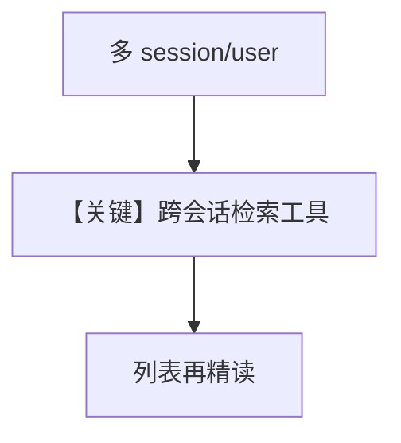

# search_session_history.py — 实现原理分析

> 源文件：`cookbook/03_teams/07_session/search_session_history.py`

## 概述

**search_past_sessions=True**（`team.py` L135–140）：队长获得 **search_past_sessions / read_past_session** 类工具；**AsyncSqliteDb** + `aprint_response`；`num_past_sessions_to_search=10`。

**核心配置一览：**

| 配置项 | 值 |
|--------|-----|
| `search_past_sessions` | `True` |
| `members` | `[]`（空成员，纯队长工具） |

## Mermaid 流程图

```mermaid
flowchart TD
    U["多 session/user"] --> S["【关键】跨会话检索工具"]
    S --> P["列表再精读"]
```

- **【关键】跨会话检索工具**：用户级历史可见性。

## 关键源码文件索引

| 文件 | 作用 |
|------|------|
| `agno/team/team.py` | L135-140 |
