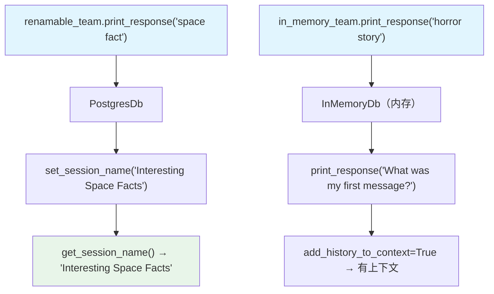

# session_options.py — 实现原理分析

> 源文件：`cookbook/03_teams/07_session/session_options.py`

## 概述

本示例展示 Agno Team 的 **多种会话配置选项**：会话命名（手动/自动生成）、`InMemoryDb` 内存数据库、`cache_session=True` 会话缓存。通过三个不同配置的 Team 演示了从开发测试到生产的会话管理选项谱系。

**核心配置一览：**

| Team | `db` | 特性 |
|------|------|------|
| `renamable_team` | `PostgresDb` | 支持手动/自动会话命名 |
| `in_memory_team` | `InMemoryDb` | 内存存储（不持久化） |
| `cached_team` | `PostgresDb` | `cache_session=True` |

## 核心组件解析

### 会话命名

```python
# 手动命名
renamable_team.set_session_name(session_name="Interesting Space Facts")

# 自动生成（LLM 根据对话内容生成）
renamable_team.set_session_name(autogenerate=True)
print(renamable_team.get_session_name())  # 如: "Space Facts Discussion"
```

自动生成会话名称适合在 UI 中展示对话列表（类似 ChatGPT 侧边栏）。

### `InMemoryDb` 适用场景

| 场景 | 推荐 DB |
|------|--------|
| 单元测试 | `InMemoryDb` |
| 本地开发调试 | `SqliteDb` |
| 生产环境 | `PostgresDb` |

`InMemoryDb` 重启后数据全部清除，不适合生产。

### `cache_session=True`

启用后，会话数据在内存中缓存，同一 `session_id` 的重复请求不重复查询数据库，减少延迟。

## Mermaid 流程图



## 关键源码文件索引

| 文件 | 关键函数/类 | 作用 |
|------|------------|------|
| `agno/team/team.py` | `set_session_name()`, `cache_session` | 会话命名和缓存 |
| `agno/db/in_memory.py` | `InMemoryDb` | 内存数据库 |
