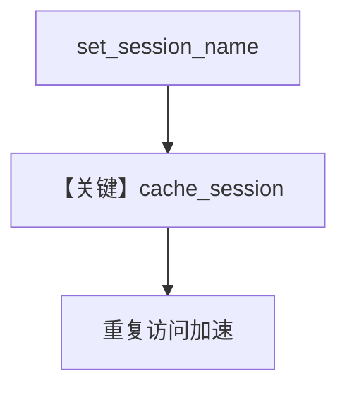

# session_options.py — 实现原理分析

> 源文件：`cookbook/03_teams/07_session/session_options.py`

## 概述

**set_session_name**（人工/自动生成）、**InMemoryDb** 无持久文件、**cache_session=True** 加速会话加载；多 Team 对照。

**核心配置一览：**

| 配置项 | 值 |
|--------|-----|
| `cache_session` | `True`（cached_team） |
| `db` | `InMemoryDb` / `PostgresDb` |

## Mermaid 流程图

```mermaid
flowchart TD
    N["set_session_name"] --> C["【关键】cache_session"]
    C --> F["重复访问加速"]
```

- **【关键】cache_session**：热会话缓存。

## 关键源码文件索引

| 文件 | 作用 |
|------|------|
| `agno/team/team.py` | `cache_session` L125-126 |
