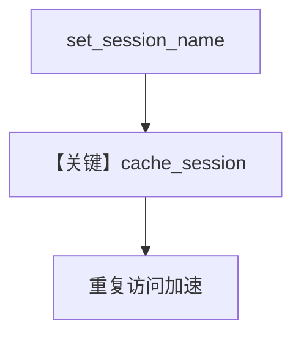

# session_options.py — 实现原理分析

<!-- cookbook-py-source:start -->
## 完整源码

```python
"""
Session Options
=============================

Demonstrates session naming, in-memory DB usage, and session caching options.
"""

from agno.agent import Agent
from agno.db.in_memory import InMemoryDb
from agno.db.postgres import PostgresDb
from agno.models.openai import OpenAIResponses
from agno.team import Team
from rich.pretty import pprint

# ---------------------------------------------------------------------------
# Setup
# ---------------------------------------------------------------------------
db_url = "postgresql+psycopg://ai:ai@localhost:5532/ai"
postgres_db = PostgresDb(db_url=db_url)
sessions_db = PostgresDb(db_url=db_url, session_table="sessions")
in_memory_db = InMemoryDb()

# ---------------------------------------------------------------------------
# Create Members
# ---------------------------------------------------------------------------
agent = Agent(model=OpenAIResponses(id="gpt-5-mini"))
research_agent = Agent(
    model=OpenAIResponses(id="gpt-5-mini"),
    name="Research Assistant",
)

# ---------------------------------------------------------------------------
# Create Team
# ---------------------------------------------------------------------------
renamable_team = Team(
    model=OpenAIResponses(id="gpt-5-mini"),
    members=[agent],
    db=postgres_db,
)

in_memory_team = Team(
    model=OpenAIResponses(id="gpt-5-mini"),
    members=[research_agent],
    db=in_memory_db,
    add_history_to_context=True,
    num_history_runs=3,
    session_id="test_session",
)

cached_team = Team(
    model=OpenAIResponses(id="gpt-5-mini"),
    members=[research_agent],
    db=sessions_db,
    session_id="team_session_cache",
    add_history_to_context=True,
    cache_session=True,
)

# ---------------------------------------------------------------------------
# Run Team
# ---------------------------------------------------------------------------
if __name__ == "__main__":
    renamable_team.print_response("Tell me a new interesting fact about space")
    renamable_team.set_session_name(session_name="Interesting Space Facts")
    print(renamable_team.get_session_name())

    renamable_team.set_session_name(autogenerate=True)
    print(renamable_team.get_session_name())

    in_memory_team.print_response("Share a 2 sentence horror story", stream=True)

    print("\n" + "=" * 50)
    print("CHAT HISTORY AFTER FIRST RUN")
    print("=" * 50)
    try:
        chat_history = in_memory_team.get_chat_history(session_id="test_session")
        pprint([m.model_dump(include={"role", "content"}) for m in chat_history])
    except Exception as e:
        print(f"Error getting chat history: {e}")
        print("This might be expected on first run with in-memory database")

    in_memory_team.print_response("What was my first message?", stream=True)

    print("\n" + "=" * 50)
    print("CHAT HISTORY AFTER SECOND RUN")
    print("=" * 50)
    try:
        chat_history = in_memory_team.get_chat_history(session_id="test_session")
        pprint([m.model_dump(include={"role", "content"}) for m in chat_history])
    except Exception as e:
        print(f"Error getting chat history: {e}")
        print("This indicates an issue with in-memory database session handling")

    cached_team.print_response("Tell me a new interesting fact about space")
```

<!-- cookbook-py-source:end -->

> 源文件：`cookbook/03_teams/07_session/session_options.py`

## 概述

**set_session_name**（人工/自动生成）、**InMemoryDb** 无持久文件、**cache_session=True** 加速会话加载；多 Team 对照。

**核心配置一览：**

| 配置项 | 值 |
|--------|-----|
| `cache_session` | `True`（cached_team） |
| `db` | `InMemoryDb` / `PostgresDb` |

## Mermaid 流程图


```mermaid
flowchart TD
    N["set_session_name"] --> C["【关键】cache_session"]
    C --> F["重复访问加速"]
```

- **【关键】cache_session**：热会话缓存。

## 关键源码文件索引

| 文件 | 作用 |
|------|------|
| `agno/team/team.py` | `cache_session` L125-126 |
