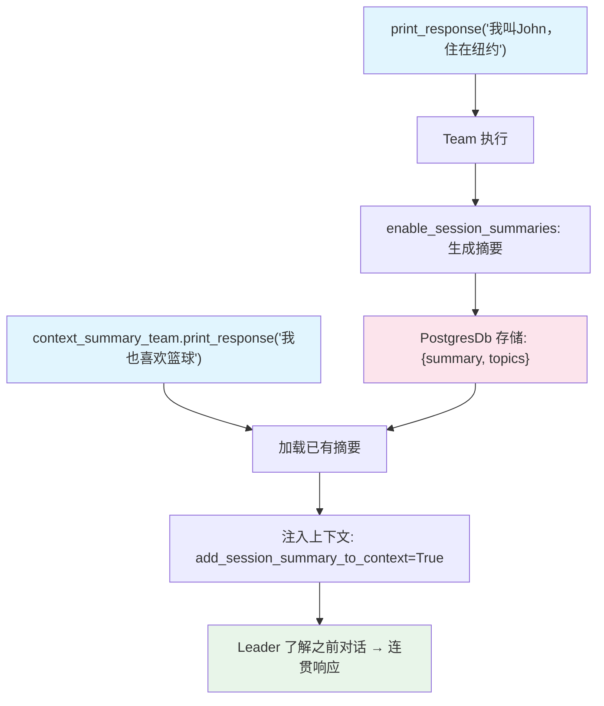

# session_summary.py — 实现原理分析

> 源文件：`cookbook/03_teams/07_session/session_summary.py`

## 概述

本示例展示 Agno Team 的 **`enable_session_summaries` 会话摘要**：启用后，每次运行结束时框架自动生成并存储会话摘要（包含主题列表），可通过 `get_session_summary()` / `aget_session_summary()` 检索，或通过 `add_session_summary_to_context=True` 自动注入后续请求的上下文。同时演示了同步 PostgresDb 和异步 AsyncPostgresDb 两种数据库用法。

**核心配置一览：**

| 配置项 | 值 | 说明 |
|--------|------|------|
| `enable_session_summaries` | `True` | 自动生成会话摘要 |
| `add_session_summary_to_context` | `True` | 摘要注入后续请求上下文 |
| `db` | `PostgresDb` / `AsyncPostgresDb` | 同步/异步 PG 数据库 |

## 核心组件解析

### 三种 Team 变体

| Team | 功能 |
|------|------|
| `summary_team` | 生成并存储会话摘要 |
| `context_summary_team` | 将已有摘要注入上下文 |
| `async_summary_team` | 异步模式，使用 `AsyncPostgresDb` |

### 摘要检索

```python
summary = summary_team.get_session_summary(session_id=session_id)
print(f"Summary: {summary.summary}")
print(f"Topics: {', '.join(summary.topics)}")
```

`summary.topics` 是 LLM 提取的讨论主题列表，可用于会话分类、搜索。

### 异步摘要

```python
summary = await async_summary_team.aget_session_summary(session_id="...")
```

完整的同步/异步对称 API。

## Mermaid 流程图



## 关键源码文件索引

| 文件 | 关键函数/类 | 作用 |
|------|------------|------|
| `agno/team/team.py` | `enable_session_summaries`, `add_session_summary_to_context` | 摘要配置 |
| `agno/db/postgres.py` | `PostgresDb`, `AsyncPostgresDb` | 同步/异步 PG 存储 |
