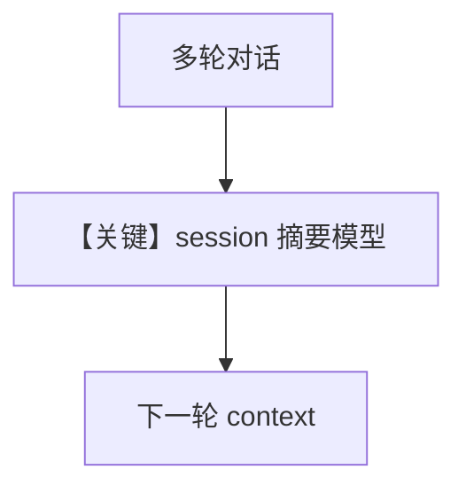

# session_summary.py — 实现原理分析

> 源文件：`cookbook/03_teams/07_session/session_summary.py`

## 概述

**enable_session_summaries** 同步/异步 DB 对照：`summary_team` 默认摘要；`context_summary_team` **add_session_summary_to_context=True**；`async_summary_team` 用 **AsyncPostgresDb** + `aprint_response`。

**核心配置一览：**

| 配置项 | 值 |
|--------|-----|
| `enable_session_summaries` | `True` |
| `add_session_summary_to_context` | `True`（context 团队） |

## Mermaid 流程图

```mermaid
flowchart TD
    I["多轮对话"] --> SM["【关键】session 摘要模型"]
    SM --> N["下一轮 context"]
```

- **【关键】session 摘要模型**：与 Agent 侧 session summary 一致。

## 关键源码文件索引

| 文件 | 作用 |
|------|------|
| `agno/session/summary.py` | 摘要管线 |
