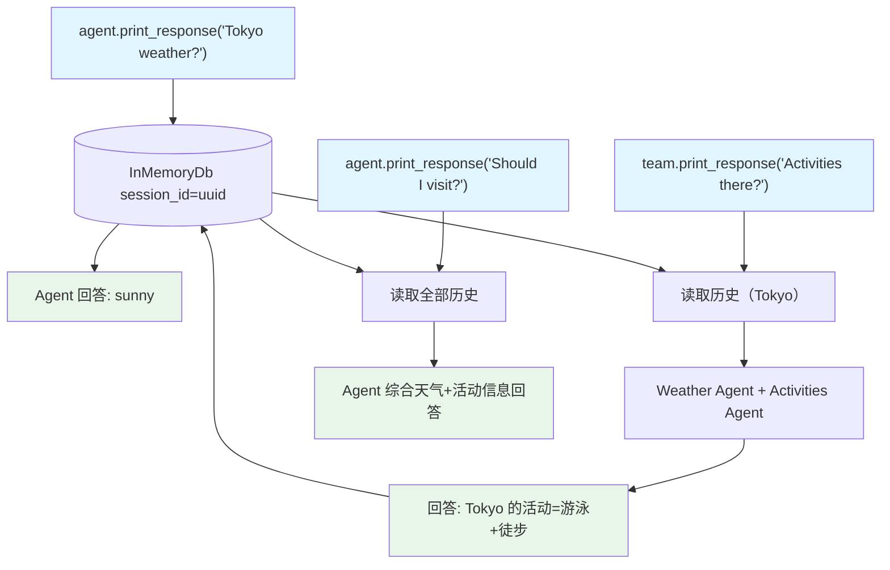

# share_session_with_agent.py — 实现原理分析

> 源文件：`cookbook/03_teams/07_session/share_session_with_agent.py`

## 概述

本示例展示 Agno Team 的 **Team 与单 Agent 共享同一 `session_id`**：`agent`（单独 Agent）和 `team`（Team）使用同一个 `InMemoryDb` 和相同 `session_id`，它们的对话历史在同一个会话中累积，后续请求可以互相引用。适合"Agent 先处理，Team 再扩展"的混合架构。

**核心配置一览：**

| 角色 | 类型 | `db` | 特性 |
|------|------|------|------|
| `agent` | 单 Agent | `InMemoryDb` | `add_history_to_context=True` |
| `team` | Team | 同一 `InMemoryDb` | `add_history_to_context=True` |

## 核心组件解析

### 共享 `session_id` 的工作原理

```python
db = InMemoryDb()
session_id = str(uuid.uuid4())

# Agent 和 Team 共享同一 db 实例和 session_id
agent = Agent(db=db, add_history_to_context=True)
team = Team(db=db, members=[weather_agent, activities_agent], add_history_to_context=True)

# 第1次: Agent 回答东京天气
agent.print_response("What is the weather in Tokyo?", session_id=session_id)
# session_id 下存储: user: Tokyo weather? assistant: sunny

# 第2次: Team 继续（"那里" 隐式引用东京）
team.print_response("What activities can I do there?", session_id=session_id)
# Team 读取历史，知道 "there" = Tokyo
```

### 实际应用场景

- **FastAPI 路由层**：不同端点（单 Agent vs Team）处理同一用户同一会话
- **渐进式升级**：原有单 Agent 逻辑保留，新功能通过 Team 扩展

## Mermaid 流程图



## 关键源码文件索引

| 文件 | 关键函数/类 | 作用 |
|------|------------|------|
| `agno/db/in_memory.py` | `InMemoryDb` | 共享内存数据库 |
| `agno/agent/agent.py` | `session_id`, `add_history_to_context` | Agent 会话配置 |
| `agno/team/team.py` | `session_id`, `add_history_to_context` | Team 会话配置 |
