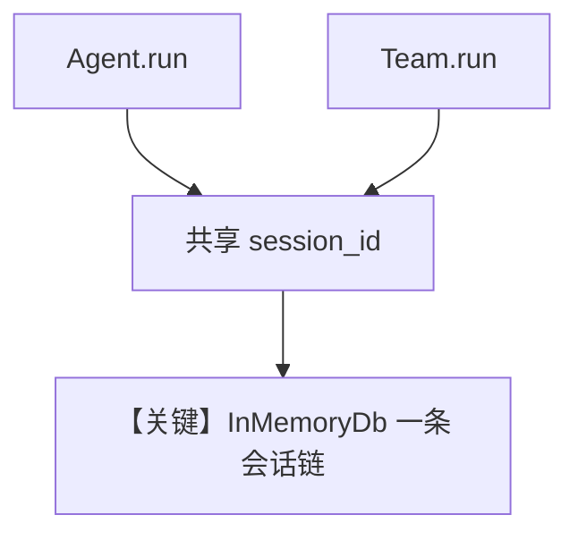

# share_session_with_agent.py — 实现原理分析

> 源文件：`cookbook/03_teams/07_session/share_session_with_agent.py`

## 概述

**同一 `session_id` 在 Agent 与 Team 间共享**：`InMemoryDb` 统一；先单 Agent 问天气，再 Team 问活动，再 Agent follow-up，依赖 **会话级** 消息连续。

**核心配置一览：**

| 配置项 | 值 |
|--------|-----|
| `db` | 同一 `InMemoryDb` 实例 |
| `session_id` | 同一 `uuid` 串 |

## Mermaid 流程图

```mermaid
flowchart TD
    A["Agent.run"] --> S["共享 session_id"]
    T["Team.run"] --> S
    S --> K["【关键】InMemoryDb 一条会话链"]
```

- **【关键】InMemoryDb 一条会话链**：跨编排形态复用上下文。

## 关键源码文件索引

| 文件 | 作用 |
|------|------|
| `agno/db/in_memory.py` | `InMemoryDb` |
