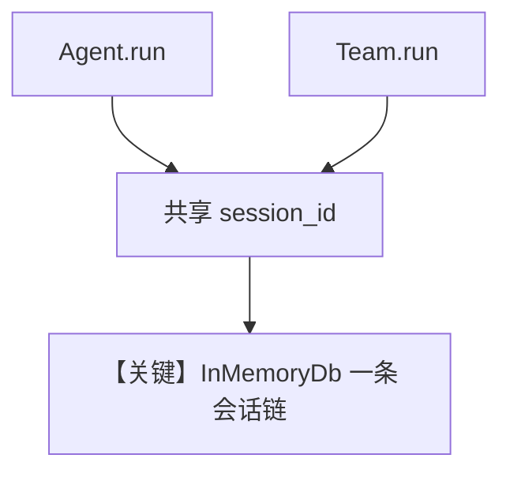

# share_session_with_agent.py — 实现原理分析

<!-- cookbook-py-source:start -->
## 完整源码

```python
"""
Share Session With Agent
========================

Demonstrates sharing one session across team and single-agent interactions.
"""

import uuid

from agno.agent import Agent
from agno.db.in_memory import InMemoryDb
from agno.models.openai import OpenAIResponses
from agno.team import Team

# ---------------------------------------------------------------------------
# Setup
# ---------------------------------------------------------------------------
db = InMemoryDb()


def get_weather(city: str) -> str:
    """Get the weather for the given city."""
    return f"The weather in {city} is sunny."


def get_activities(city: str) -> str:
    """Get the activities for the given city."""
    return f"The activities in {city} are swimming and hiking."


# ---------------------------------------------------------------------------
# Create Members
# ---------------------------------------------------------------------------
agent = Agent(
    name="City Planner Agent",
    id="city-planner-agent-id",
    model=OpenAIResponses(id="gpt-5.2"),
    db=db,
    tools=[get_weather, get_activities],
    add_history_to_context=True,
)

weather_agent = Agent(
    name="Weather Agent",
    id="weather-agent-id",
    model=OpenAIResponses(id="gpt-5.2"),
    tools=[get_weather],
)

activities_agent = Agent(
    name="Activities Agent",
    id="activities-agent-id",
    model=OpenAIResponses(id="gpt-5.2"),
    tools=[get_activities],
)

# ---------------------------------------------------------------------------
# Create Team
# ---------------------------------------------------------------------------
team = Team(
    name="City Planner Team",
    id="city-planner-team-id",
    model=OpenAIResponses(id="gpt-5.2"),
    db=db,
    members=[weather_agent, activities_agent],
    add_history_to_context=True,
)

# ---------------------------------------------------------------------------
# Run Team
# ---------------------------------------------------------------------------
if __name__ == "__main__":
    session_id = str(uuid.uuid4())

    agent.print_response("What is the weather like in Tokyo?", session_id=session_id)
    team.print_response("What activities can I do there?", session_id=session_id)
    agent.print_response(
        "What else can you tell me about the city? Should I visit?",
        session_id=session_id,
    )
```

<!-- cookbook-py-source:end -->

> 源文件：`cookbook/03_teams/07_session/share_session_with_agent.py`

## 概述

**同一 `session_id` 在 Agent 与 Team 间共享**：`InMemoryDb` 统一；先单 Agent 问天气，再 Team 问活动，再 Agent follow-up，依赖 **会话级** 消息连续。

**核心配置一览：**

| 配置项 | 值 |
|--------|-----|
| `db` | 同一 `InMemoryDb` 实例 |
| `session_id` | 同一 `uuid` 串 |

## Mermaid 流程图


```mermaid
flowchart TD
    A["Agent.run"] --> S["共享 session_id"]
    T["Team.run"] --> S
    S --> K["【关键】InMemoryDb 一条会话链"]
```

- **【关键】InMemoryDb 一条会话链**：跨编排形态复用上下文。

## 关键源码文件索引

| 文件 | 作用 |
|------|------|
| `agno/db/in_memory.py` | `InMemoryDb` |
