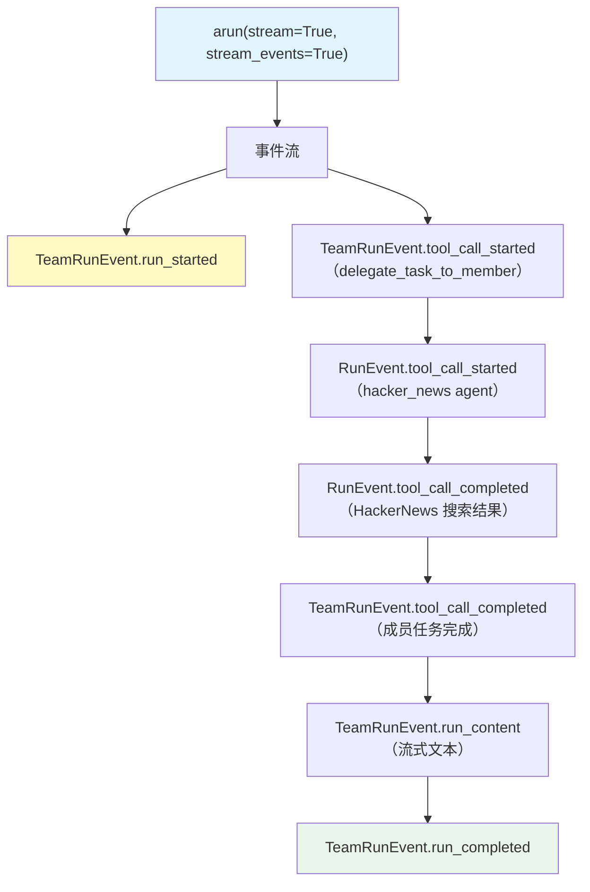

# team_events.py — 实现原理分析

> 源文件：`cookbook/03_teams/08_streaming/team_events.py`

## 概述

本示例展示 Agno Team 的 **细粒度事件流监控**：通过 `stream_events=True` 枚举 `TeamRunEvent`（Team 级）和 `RunEvent`（成员级）事件，实现工具调用前后的全链路可观测性。同时演示了 `events_to_skip` 过滤特定事件类型。

**核心配置一览：**

| 配置项 | 值 | 说明 |
|--------|------|------|
| `events_to_skip` | `[TeamRunEvent.run_started, TeamRunEvent.run_completed]` | 跳过特定事件（但示例仍打印它们） |
| `show_members_responses` | `True` | 成员响应显示 |
| `members` | `[hacker_news_agent, website_agent]` | 两名带工具的成员 |

## 核心组件解析

### 事件类型分类

| 事件类 | 枚举值 | 来源 |
|--------|-------|------|
| `TeamRunEvent.run_started` | Team 开始 | Leader |
| `TeamRunEvent.run_completed` | Team 结束 | Leader |
| `TeamRunEvent.tool_call_started` | Team 工具调用开始 | Leader（如 delegate_task_to_member） |
| `TeamRunEvent.tool_call_completed` | Team 工具调用完成 | Leader |
| `TeamRunEvent.run_content` | 流式文本块 | Leader 响应内容 |
| `RunEvent.tool_call_started` | 成员工具调用开始 | 成员 Agent |
| `RunEvent.tool_call_completed` | 成员工具调用完成 | 成员 Agent |

### `events_to_skip` 的作用

配置在 Team 上的 `events_to_skip` 告知框架在构建事件流时跳过这些事件，减少不必要的事件发射量。但本示例在 Python 消费代码中仍然处理了这两种事件（演示目的）。

### 区分 Team 事件 vs 成员事件

通过事件类型命名空间区分：
- `TeamRunEvent.*` → Leader 的动作
- `RunEvent.*` → 成员 Agent 的动作（含 `agent_id` 字段标识来源）

## Mermaid 流程图

## 关键源码文件索引

| 文件 | 关键函数/类 | 作用 |
|------|------------|------|
| `agno/team/__init__.py` | `TeamRunEvent` | Team 级事件枚举 |
| `agno/agent/__init__.py` | `RunEvent` | 成员 Agent 事件枚举 |
| `agno/team/team.py` | `events_to_skip` | 事件过滤配置 |
