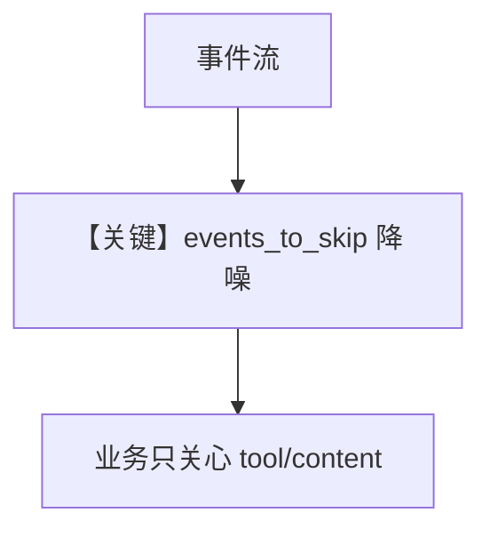

# team_events.py — 实现原理分析

<!-- cookbook-py-source:start -->
## 完整源码

```python
"""
Team Events
===========

Demonstrates monitoring team and member events in sync-like and async event streams.
"""

import asyncio
from uuid import uuid4

from agno.agent import Agent, RunEvent
from agno.models.openai import OpenAIResponses
from agno.team import Team, TeamRunEvent
from agno.tools.hackernews import HackerNewsTools
from agno.tools.websearch import WebSearchTools

# ---------------------------------------------------------------------------
# Create Members
# ---------------------------------------------------------------------------
hacker_news_agent = Agent(
    id="hacker-news-agent",
    name="Hacker News Agent",
    role="Search Hacker News for information",
    tools=[HackerNewsTools()],
    instructions=[
        "Find articles about the company in the Hacker News",
    ],
)

website_agent = Agent(
    id="website-agent",
    name="Website Agent",
    role="Search the website for information",
    model=OpenAIResponses(id="gpt-5-mini"),
    tools=[WebSearchTools()],
    instructions=[
        "Search the website for information",
    ],
)

# ---------------------------------------------------------------------------
# Create Team
# ---------------------------------------------------------------------------
user_id = str(uuid4())
team_id = str(uuid4())

company_info_team = Team(
    name="Company Info Team",
    id=team_id,
    user_id=user_id,
    model=OpenAIResponses(id="gpt-5.2"),
    members=[hacker_news_agent, website_agent],
    markdown=True,
    instructions=[
        "You are a team that finds information about a company.",
        "First search the web and Hacker News for information about the company.",
        "If you can find the company's website URL, then scrape the homepage and the about page.",
    ],
    show_members_responses=True,
    events_to_skip=[TeamRunEvent.run_started, TeamRunEvent.run_completed],
)


# ---------------------------------------------------------------------------
# Run Team
# ---------------------------------------------------------------------------
async def run_team_with_events(prompt: str) -> None:
    content_started = False
    async for run_output_event in company_info_team.arun(
        prompt,
        stream=True,
        stream_events=True,
    ):
        if run_output_event.event in [
            TeamRunEvent.run_started,
            TeamRunEvent.run_completed,
        ]:
            print(f"\nTEAM EVENT: {run_output_event.event}")

        if run_output_event.event in [TeamRunEvent.tool_call_started]:
            print(f"\nTEAM EVENT: {run_output_event.event}")
            print(f"TOOL CALL: {run_output_event.tool.tool_name}")
            print(f"TOOL CALL ARGS: {run_output_event.tool.tool_args}")

        if run_output_event.event in [TeamRunEvent.tool_call_completed]:
            print(f"\nTEAM EVENT: {run_output_event.event}")
            print(f"TOOL CALL: {run_output_event.tool.tool_name}")
            print(f"TOOL CALL RESULT: {run_output_event.tool.result}")

        if run_output_event.event in [RunEvent.tool_call_started]:
            print(f"\nMEMBER EVENT: {run_output_event.event}")
            print(f"AGENT ID: {run_output_event.agent_id}")
            print(f"TOOL CALL: {run_output_event.tool.tool_name}")
            print(f"TOOL CALL ARGS: {run_output_event.tool.tool_args}")

        if run_output_event.event in [RunEvent.tool_call_completed]:
            print(f"\nMEMBER EVENT: {run_output_event.event}")
            print(f"AGENT ID: {run_output_event.agent_id}")
            print(f"TOOL CALL: {run_output_event.tool.tool_name}")
            print(f"TOOL CALL RESULT: {run_output_event.tool.result}")

        if run_output_event.event in [TeamRunEvent.run_content]:
            if not content_started:
                print("CONTENT")
                content_started = True
            else:
                print(run_output_event.content, end="")


if __name__ == "__main__":
    # Async event streaming
    asyncio.run(
        run_team_with_events(
            "Write me a full report on everything you can find about Agno, the company building AI agent infrastructure.",
        )
    )
```

<!-- cookbook-py-source:end -->

> 源文件：`cookbook/03_teams/08_streaming/team_events.py`

## 概述

**stream_events + TeamRunEvent**：`arun(..., stream=True, stream_events=True)` 消费事件；**events_to_skip** 过滤 `run_started`/`run_completed` 减少噪声；监听 `tool_call_started` 与成员侧 `RunEvent`。

**核心配置一览：**

| 配置项 | 值 |
|--------|-----|
| `events_to_skip` | `[TeamRunEvent.run_started, TeamRunEvent.run_completed]` |
| `stream` / `stream_events` | `True` |

## Mermaid 流程图


```mermaid
flowchart TD
    E["事件流"] --> F["【关键】events_to_skip 降噪"]
    F --> L["业务只关心 tool/content"]
```

- **【关键】events_to_skip 降噪**：可编程订阅团队流。

## 关键源码文件索引

| 文件 | 作用 |
|------|------|
| `agno/run/team.py` | `TeamRunEvent`、流事件类型 |
| `agno/team/team.py` | `events_to_skip`（若存在） |
