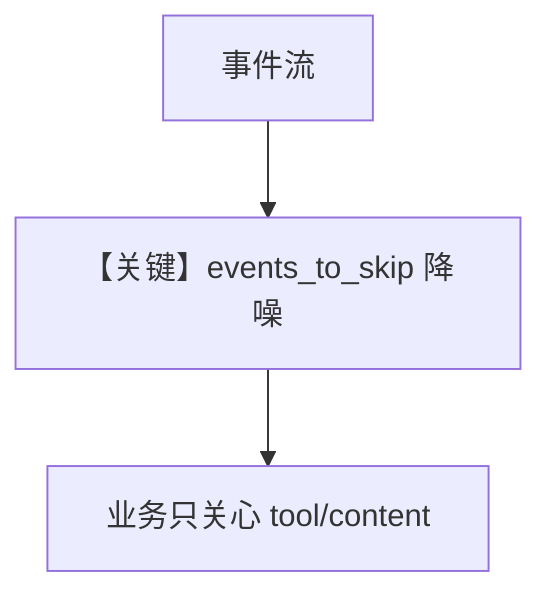

# team_events.py — 实现原理分析

> 源文件：`cookbook/03_teams/08_streaming/team_events.py`

## 概述

**stream_events + TeamRunEvent**：`arun(..., stream=True, stream_events=True)` 消费事件；**events_to_skip** 过滤 `run_started`/`run_completed` 减少噪声；监听 `tool_call_started` 与成员侧 `RunEvent`。

**核心配置一览：**

| 配置项 | 值 |
|--------|-----|
| `events_to_skip` | `[TeamRunEvent.run_started, TeamRunEvent.run_completed]` |
| `stream` / `stream_events` | `True` |

## Mermaid 流程图

```mermaid
flowchart TD
    E["事件流"] --> F["【关键】events_to_skip 降噪"]
    F --> L["业务只关心 tool/content"]
```

- **【关键】events_to_skip 降噪**：可编程订阅团队流。

## 关键源码文件索引

| 文件 | 作用 |
|------|------|
| `agno/run/team.py` | `TeamRunEvent`、流事件类型 |
| `agno/team/team.py` | `events_to_skip`（若存在） |
