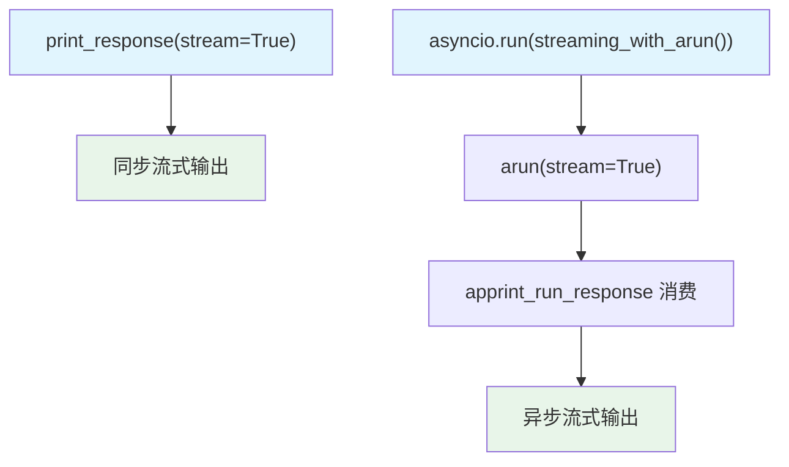

# team_streaming.py — 实现原理分析

> 源文件：`cookbook/03_teams/08_streaming/team_streaming.py`

## 概述

本示例展示 Agno Team 的 **同步和异步流式响应**：覆盖 `print_response(stream=True)`、`arun(stream=True)` + `apprint_run_response`、`aprint_response(stream=True)` 三种流式消费方式，以及 `show_member_responses=False` 运行时覆盖。

**核心配置一览：**

| 配置项 | 值 | 说明 |
|--------|------|------|
| `show_members_responses` | `True` | 默认显示成员响应 |
| `members` | `[stock_searcher, company_info_agent]` | 两名金融数据成员 |
| `model` | `gpt-5-mini`（Leader 和成员） | 轻量模型 |

## 核心组件解析

### 三种流式 API 对比

| API | 同步/异步 | 返回值 | 特点 |
|-----|----------|-------|------|
| `print_response(stream=True)` | 同步 | None（打印） | 最简单 |
| `arun(stream=True)` | 异步 | 异步生成器 | 可自定义消费 |
| `aprint_response(stream=True)` | 异步 | None（打印） | 异步版 print |

### `apprint_run_response` 工具函数

```python
await apprint_run_response(
    team.arun(input="...", stream=True)
)
```

`apprint_run_response` 消费 `arun` 返回的异步生成器，格式化打印每个流式块，内部等价于：

```python
async for chunk in team.arun(input, stream=True):
    print(chunk.content, end="")
```

### `show_member_responses=False` 运行时覆盖

```python
team.print_response("TSLA news?", stream=True, show_member_responses=False)
```

此参数在 `run()` 层临时覆盖 Team 的 `show_members_responses=True` 配置，仅影响该次运行。

## Mermaid 流程图



## 关键源码文件索引

| 文件 | 关键函数/类 | 作用 |
|------|------------|------|
| `agno/team/team.py` | `arun()`, `aprint_response()` | 异步流式执行 |
| `agno/utils/pprint.py` | `apprint_run_response()` | 异步响应格式化打印 |
