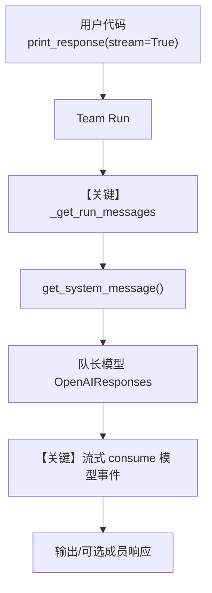

# team_streaming.py — 实现原理分析

> 源文件：`cookbook/03_teams/08_streaming/team_streaming.py`

## 概述

本示例展示 Agno 的 **Team 流式输出（sync/async）** 机制：在队长模型协调多成员的前提下，通过 `stream=True` 将 `Team.print_response` / `Team.arun` 的模型输出以流式事件形式展示，并可控制是否打印成员中间结果。

**核心配置一览：**

| 配置项 | 值 | 说明 |
|--------|------|------|
| `name` | `"Stock Research Team"` | Team 名称 |
| `model` | `OpenAIResponses(id="gpt-5-mini")` | Responses API（队长） |
| `members` | `[stock_searcher, company_info_agent]` | 两名专用 Agent |
| `markdown` | `True` | 系统侧附加 markdown 说明 |
| `show_members_responses` | `True`（默认）；第二次 `print_response` 传 `False` | 是否展示成员回复 |
| `description` | `None` | 未设置 |
| `db` / `session_id` | `None` | 未设置 |
| 成员 `stock_searcher` | `OpenAIResponses`, `YFinanceTools(...)` | 股价/分析师建议 |
| 成员 `company_info_agent` | `OpenAIResponses`, `YFinanceTools(...)` | 公司信息与新闻 |

## 架构分层

```
用户代码层                agno.team 层
┌──────────────────┐    ┌──────────────────────────────────┐
│ team_streaming   │    │ Team.print_response / arun       │
│ stream=True      │───>│  _get_run_messages / _messages  │
│                  │    │    get_system_message()          │
│                  │    │  Team 协调循环 + 成员调用        │
└──────────────────┘    └──────────────────────────────────┘
                                │
                                ▼
                        ┌──────────────┐
                        │ OpenAIResponses │
                        │ gpt-5-mini      │
                        │ responses.create│
                        └──────────────┘
```

## 核心组件解析

### Team 与成员分工

`Team` 使用默认 **coordinate** 模式（见 `agno/team/_messages.py` 中 `_get_mode_instructions`），队长根据用户问题委托成员；成员各自配置 `YFinanceTools` 不同子能力。

### 流式 API

同步路径：`team.print_response(..., stream=True)` 最终驱动模型适配器的流式调用（`OpenAIResponses` 提供 `invoke_stream` / `ainvoke_stream` 等，与 `stream=True` 组合）。

### 运行机制与因果链

1. **数据路径**：用户字符串 → Team Run → 组装 `RunMessages`（`agno/team/_messages.py` 中 `_get_run_messages`，约 L779）→ 队长 `OpenAIResponses` 多轮（含工具/委托）→ 控制台流式输出；`apprint_run_response(team.arun(..., stream=True))` 为异步等价路径。
2. **状态**：未配置 `db`，无持久会话；`show_members_responses=False` 仅影响打印层，不改变委托逻辑。
3. **分支**：`stream=True` 走流式；`show_member_responses` 控制是否输出成员内容。
4. **定位**：相对「非流式 Team」，本文件只强调 **sync/async 两种流式入口** 与 **成员响应可见性**。

## System Prompt 组装

| 序号 | 组成部分 | 本文件中的值/来源 | 是否生效 |
|------|---------|-----------------|---------|
| 1 | `system_message` 直接覆盖 | `None` | 否 |
| 2 | 默认 Team 拼装 | `_build_team_context` + `_build_identity_sections` + `_build_trailing_sections` | 是 |
| 3 | `instructions`（Team） | `None` | 否 |
| 4 | `markdown` | `True` | 是（附加「Use markdown…」） |
| 5 | 成员块 | `<team_members>` 内两名成员 role/tools 摘要 | 是 |

### 拼装顺序与源码锚点

1. `get_system_message()`（`agno/team/_messages.py` L328 起）未设置 `team.system_message` 时走默认分支 L385+。
2. L457-461：`_build_team_context`（开场白 + `<team_members>` + `<how_to_respond>` coordinate 段）。
3. L461：`_build_identity_sections`（本示例无 description/role/instructions，基本为空或仅模型侧）。
4. L412-414：`markdown` → `additional_information`。
5. L528-541：`_build_trailing_sections`（含 model 的 `get_system_message_for_model` 等）。

### 还原后的完整 System 文本

本示例未提供自定义 `system_message`，完整正文由框架拼接，**静态无法逐字复现运行时成员列表与工具名**，但**确定包含** `_get_opening_prompt()` 的固定开场（`agno/team/_messages.py` L112-117）及 coordinate 模式 `<how_to_respond>` 段（L176-191）。验证方式：在 `get_system_message()` 返回前对 `Message.content` 打断点或临时打印。

### 段落释义（模型视角）

- 开场白约束队长以「协调 specialized agents」的方式工作。
- `<team_members>` 提供成员 ID、角色、（在 `add_member_tools_to_context` 时）工具名；本示例未开该标志则工具行可能不出现，取决于默认。
- `<how_to_respond>` 定义 coordinate 下的委托与汇总策略。
- Markdown 提示要求格式化输出。

### 与 User 消息的边界

用户问题作为本轮 `user` 消息追加在 system 与历史之后；`OpenAIResponses` 将 `system` 映射为 `developer` 角色（见 `role_map`，`responses.py` L84-91）。

## 完整 API 请求

```python
# OpenAIResponses → Responses API（非 Chat Completions）
# 等价形态（简化，真实参数由 get_request_params 合并）：

client.responses.create(
    model="gpt-5-mini",
    input=formatted_input,  # 由 _format_messages 从 RunMessages 转换；system→developer
    # tools=..., 若本轮挂载团队工具
)
```

> 流式时使用 `responses` 的流式接口（见 `invoke_stream`/`ainvoke_stream`），`input` 形态与非流式一致，区别在响应消费方式。

## Mermaid 流程图


```mermaid
flowchart TD
    U["用户代码<br/>print_response(stream=True)"] --> R["Team Run"]
    R --> M["【关键】_get_run_messages"]
    M --> S["get_system_message()"]
    S --> L["队长模型 OpenAIResponses"]
    L --> V["【关键】流式 consume 模型事件"]
    V --> P["输出/可选成员响应"]
```

- **【关键】_get_run_messages**：决定 system、历史、`additional_input` 等与 user 的拼接顺序。
- **【关键】流式 consume**：本示例演示重点为 stream 路径。

## 关键源码文件索引

| 文件 | 关键函数/类 | 作用 |
|------|------------|------|
| `agno/team/_messages.py` | `get_system_message()` L328-551 | Team 默认 system 拼装 |
| `agno/team/_messages.py` | `_get_run_messages()` L779+ | 组装完整消息列表 |
| `agno/models/openai/responses.py` | `OpenAIResponses.invoke()` L671-695 | `responses.create` |
| `agno/models/openai/responses.py` | `role_map` L84-91 | system→developer |
