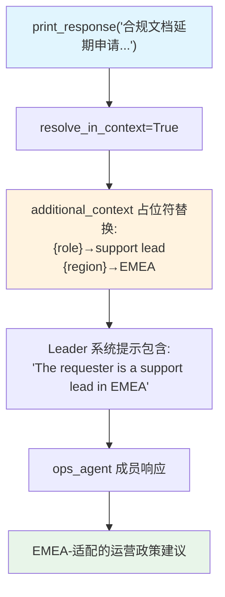

# additional_context.py — 实现原理分析

> 源文件：`cookbook/03_teams/09_context_management/additional_context.py`

## 概述

本示例展示 Agno Team 的 **`additional_context` 占位符模板**：`additional_context` 字段支持 `{variable}` 占位符，结合 `resolve_in_context=True` 和 `dependencies` 字典，在运行时将占位符替换为实际值后注入 Leader 的系统提示。

**核心配置一览：**

| 配置项 | 值 | 说明 |
|--------|------|------|
| `additional_context` | `"...{role}...{region}..."` | 含占位符的上下文模板 |
| `resolve_in_context` | `True` | 启用占位符解析 |
| `dependencies` | `{"role": "support lead", "region": "EMEA"}` | 占位符对应值 |

## 核心组件解析

### 占位符解析机制

```python
additional_context = "The requester is a {role} in the {region}."
dependencies = {"role": "support lead", "region": "EMEA"}

# resolve_in_context=True 时，运行前替换为:
# "The requester is a support lead in the EMEA."
```

解析后的字符串注入 Leader 系统提示，使 LLM 了解请求者的角色和地区背景，从而生成更具针对性的运营建议。

### 动态 `dependencies`

`dependencies` 也可以在 `run()` 时传入（per-run 覆盖），实现运行时动态上下文：

```python
team.run(query, dependencies={"role": "manager", "region": "APAC"})
```

## Mermaid 流程图



## 关键源码文件索引

| 文件 | 关键函数/类 | 作用 |
|------|------------|------|
| `agno/team/team.py` | `additional_context`, `resolve_in_context`, `dependencies` | 上下文模板配置 |
| `agno/team/_messages.py` | `_build_trailing_sections()` | additional_context 注入系统提示 |
