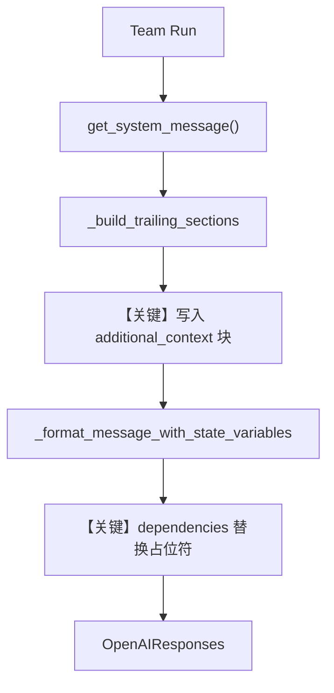

# additional_context.py — 实现原理分析

<!-- cookbook-py-source:start -->
## 完整源码

```python
"""
Additional Context
=================

Demonstrates adding custom `additional_context` and resolving placeholders at
run time through Team context resolution.
"""

from agno.agent import Agent
from agno.models.openai import OpenAIResponses
from agno.team import Team

# ---------------------------------------------------------------------------
# Create Members
# ---------------------------------------------------------------------------
ops_agent = Agent(
    name="Ops Copilot",
    model=OpenAIResponses(id="gpt-5-mini"),
    instructions=[
        "Follow operational policy and include ownership guidance.",
    ],
)


# ---------------------------------------------------------------------------
# Create Team
# ---------------------------------------------------------------------------
policy_team = Team(
    name="Policy Team",
    model=OpenAIResponses(id="gpt-5-mini"),
    members=[ops_agent],
    additional_context=(
        "The requester is a {role} in the {region}. Use language suitable for an "
        "internal process update and include owner + timeline whenever possible."
    ),
    resolve_in_context=True,
    dependencies={"role": "support lead", "region": "EMEA"},
    instructions=["Answer as a practical operational policy assistant."],
    markdown=True,
)


# ---------------------------------------------------------------------------
# Run Team
# ---------------------------------------------------------------------------
if __name__ == "__main__":
    policy_team.print_response(
        "A partner asked for a temporary extension on compliance docs.",
        stream=True,
    )
```

<!-- cookbook-py-source:end -->

> 源文件：`cookbook/03_teams/09_context_management/additional_context.py`

## 概述

本示例展示 Agno 的 **`additional_context` + `dependencies` 占位符解析** 机制：在 Team 的 system 尾部注入 `<additional_context>`，并通过 `resolve_in_context` 将 `{role}`、`{region}` 等替换为运行期依赖值。

**核心配置一览：**

| 配置项 | 值 | 说明 |
|--------|------|------|
| `name` | `"Policy Team"` | Team 名称 |
| `model` | `OpenAIResponses(id="gpt-5-mini")` | Responses API |
| `members` | `[ops_agent]` | 单成员 |
| `additional_context` | 含 `{role}`、`{region}` 的长字符串 | 业务语境 |
| `resolve_in_context` | `True` | 解析占位符 |
| `dependencies` | `{"role": "support lead", "region": "EMEA"}` | 占位符取值 |
| `instructions` | `["Answer as a practical operational policy assistant."]` | 队长指令 |
| `markdown` | `True` | Markdown 提示 |
| `system_message` | `None` | 未设置（走默认拼装） |

## 架构分层

```
用户代码层                agno.team 层
┌──────────────────┐    ┌──────────────────────────────────┐
│ policy_team      │    │ get_system_message()             │
│ dependencies     │───>│ _build_trailing_sections         │
│ additional_context│   │   <additional_context> 块         │
│                  │    │ _format_message_with_state_variables│
└──────────────────┘    └──────────────────────────────────┘
                                │
                                ▼
                        OpenAIResponses (gpt-5-mini)
```

## 核心组件解析

### `<additional_context>` 注入

`_build_trailing_sections()`（`agno/team/_messages.py` L307-308）在尾部追加：

```python
content += f"<additional_context>\n{team.additional_context.strip()}\n</additional_context>\n\n"
```

### 占位符解析

默认拼装末尾（L543-549）若 `resolve_in_context` 为 True，对整段 `system_message_content` 调用 `_format_message_with_state_variables`，将 `dependencies` 与 session 状态合并后替换 `{key}`。

### 运行机制与因果链

1. **路径**：用户输入 → `_get_run_messages` → `get_system_message` 拼默认 system（含 additional_context）→ `_format_message_with_state_variables` → 模型。
2. **状态**：无 `db`；`dependencies` 仅用于格式化，不单独持久化。
3. **分支**：若 `resolve_in_context=False`，占位符可能保持字面 `{role}` 形式（取决于实现）。
4. **定位**：演示 **政策类附加语境** 与 **依赖字典**，区别于仅改 `instructions` 的示例。

## System Prompt 组装

| 序号 | 组成部分 | 本文件中的值/来源 | 是否生效 |
|------|---------|-----------------|---------|
| 1 | 默认 Team 上下文 | `_build_team_context` | 是 |
| 2 | `instructions` | 见上表 | 是 |
| 3 | `markdown` | `True` | 是 |
| 4 | `<additional_context>` | 字面 + 解析后 `role`/`region` | 是 |

### 拼装顺序与源码锚点

1. L457-461：团队与身份段。
2. L528-541：`_build_trailing_sections` 内含 L307-308 的 `<additional_context>`。
3. L543-549：全量 `_format_message_with_state_variables`（**解析 `{role}`、`{region}`**）。

### 还原后的完整 System 文本

下列 **additional_context 字面** 来自 cookbook（占位符在运行时被替换）：

```text
The requester is a {role} in the {region}. Use language suitable for an internal process update and include owner + timeline whenever possible.
```

解析后期望形态示例（依赖 `dependencies`）：

```text
The requester is a support lead in the EMEA. Use language suitable for an internal process update and include owner + timeline whenever possible.
```

完整 system 另含 `_get_opening_prompt`、`<team_members>`、coordinate `<how_to_respond>` 等；需运行时打印验证。

### 段落释义

- `<additional_context>` 给队长固定业务背景（内部流程、owner、时间线）。
- `instructions` 强调「可操作的政策助手」口吻。
- 解析后的占位符把抽象模板变成具体区域与角色。

### 与 User 消息的边界

用户问题（如合规延期）作为 user 消息；上述均为 system/developer 侧约束。

## 完整 API 请求

```python
client.responses.create(
    model="gpt-5-mini",
    input=formatted_input,  # developer 侧含解析后的 additional_context
)
```

## Mermaid 流程图


```mermaid
flowchart TD
    A["Team Run"] --> B["get_system_message()"]
    B --> C["_build_trailing_sections"]
    C --> D["【关键】写入 additional_context 块"]
    D --> E["_format_message_with_state_variables"]
    E --> F["【关键】dependencies 替换占位符"]
    F --> G["OpenAIResponses"]
```

## 关键源码文件索引

| 文件 | 关键函数/类 | 作用 |
|------|------------|------|
| `agno/team/_messages.py` | `_build_trailing_sections()` L254-325 | 附加 `<additional_context>` |
| `agno/team/_messages.py` | `get_system_message()` L543-549 | 全量 resolve |
| `agno/team/team.py` | `additional_context` / `dependencies` 字段 | 配置入口 |
