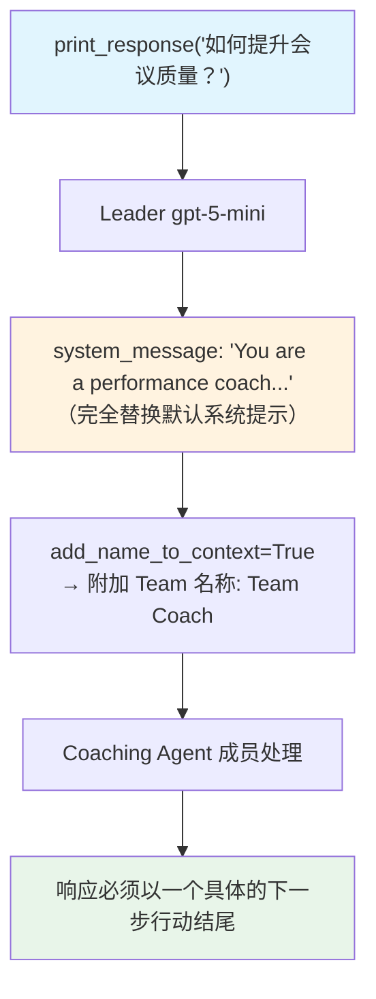

# custom_system_message.py — 实现原理分析

> 源文件：`cookbook/03_teams/09_context_management/custom_system_message.py`

## 概述

本示例展示 Agno Team 的 **`system_message` 完全替换系统提示**：当设置 `system_message` 时，Agno 默认构建的 Team 系统提示（含成员列表、模式说明等）被完全替换为指定字符串，适合需要完全控制 Leader 行为的高级场景。`system_message_role` 控制该消息以何种角色注入（通常为 `"system"`）。

**核心配置一览：**

| 配置项 | 值 | 说明 |
|--------|------|------|
| `system_message` | `"You are a performance coach..."` | 完全自定义系统提示 |
| `system_message_role` | `"system"` | 消息角色（system/user） |
| `add_name_to_context` | `True` | 在上下文中包含 Team 名称 |
| `instructions` | 额外指令 | 追加到 system_message 后 |

## 核心组件解析

### `system_message` 的优先级

当 `system_message` 存在时，`agno/team/_messages.py` 中的 `get_system_message()` 会直接使用该字符串，跳过自动构建的成员列表、模式说明等所有内容。

### `system_message_role` 的作用

| 值 | 效果 |
|----|------|
| `"system"` | 作为系统消息注入（标准模式） |
| `"user"` | 作为用户消息注入（部分模型更响应） |

### 何时使用自定义 System Message

- 成员列表信息不需要暴露给 LLM（简单单成员 Team）
- 需要极简且高度定制化的指导语
- 集成到第三方框架，要求特定格式的 system prompt

## Mermaid 流程图

## 关键源码文件索引

| 文件 | 关键函数/类 | 作用 |
|------|------------|------|
| `agno/team/_messages.py` | `get_system_message()` | 系统提示构建（含自定义逻辑） |
| `agno/team/team.py` | `system_message`, `system_message_role` | 自定义系统提示配置 |
