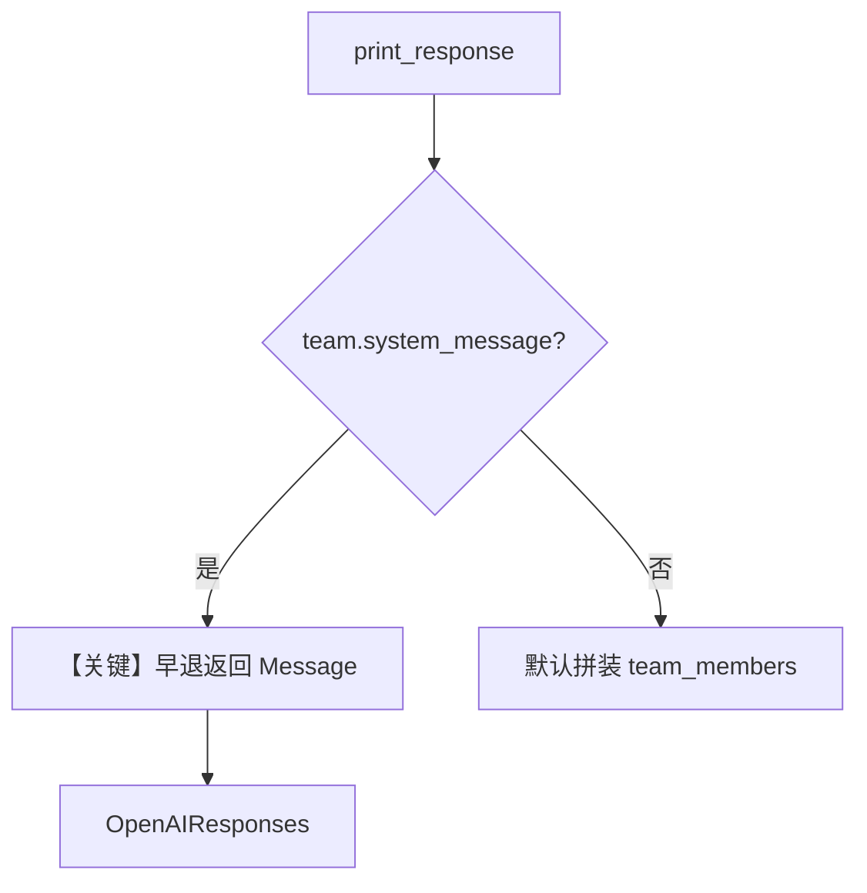

# custom_system_message.py — 实现原理分析

<!-- cookbook-py-source:start -->
## 完整源码

```python
"""
Custom Team System Message
=========================

Demonstrates setting a custom system message, role, and including the team
name in context.
"""

from agno.agent import Agent
from agno.models.openai import OpenAIResponses
from agno.team import Team

# ---------------------------------------------------------------------------
# Create Members
# ---------------------------------------------------------------------------
coach = Agent(
    name="Coaching Agent",
    model=OpenAIResponses(id="gpt-5-mini"),
    instructions=[
        "Offer practical, concise improvements.",
        "Keep advice actionable and realistic.",
    ],
)


# ---------------------------------------------------------------------------
# Create Team
# ---------------------------------------------------------------------------
coaching_team = Team(
    name="Team Coach",
    model=OpenAIResponses(id="gpt-5-mini"),
    members=[coach],
    instructions=["Focus on high-leverage behavior changes."],
    system_message=(
        "You are a performance coach for remote teams. "
        "Every answer must end with one concrete next action."
    ),
    system_message_role="system",
    add_name_to_context=True,
)


# ---------------------------------------------------------------------------
# Run Team
# ---------------------------------------------------------------------------
if __name__ == "__main__":
    coaching_team.print_response(
        "How should my team improve meeting quality this week?",
        stream=True,
    )
```

<!-- cookbook-py-source:end -->

> 源文件：`cookbook/03_teams/09_context_management/custom_system_message.py`

## 概述

本示例展示 Agno 的 **Team 自定义 `system_message`** 机制：当提供字符串或 `Message` 时，`get_system_message()` **早退**，不再拼接默认的 `<team_members>` 长模板（除非你在自定义内容中自行包含）；并可指定 `system_message_role` 与 `add_name_to_context`。

**核心配置一览：**

| 配置项 | 值 | 说明 |
|--------|------|------|
| `name` | `"Team Coach"` | Team 名称 |
| `model` | `OpenAIResponses(id="gpt-5-mini")` | Responses API |
| `members` | `[coach]` | 单成员 |
| `instructions` | `["Focus on high-leverage behavior changes."]` | 若走默认会进 instructions；**本例被 system_message 早退覆盖** |
| `system_message` | 见下「还原」 | 自定义全文 |
| `system_message_role` | `"system"` | 消息角色 |
| `add_name_to_context` | `True` | 见下行 |
| `markdown` | `None` | 未设置 |

注意：当 `team.system_message is not None` 时，`get_system_message` 在 L355-383 **直接返回**，**不会**执行 L385 之后的默认拼装；因此 **`add_name_to_context` 在本路径下不会通过 1.3.4 段注入**（该逻辑在默认分支 L450-452）。若需名称，应写入 `system_message` 正文或改用默认拼装。

## 架构分层

```
用户代码层                agno.team 层
┌──────────────────┐    ┌──────────────────────────────────┐
│ coaching_team    │    │ get_system_message()             │
│ system_message=  │───>│ 分支: team.system_message 非空   │
│                  │    │  → Message(role, content) 早退   │
└──────────────────┘    └──────────────────────────────────┘
```

## 核心组件解析

### 早退分支

```355:383:libs/agno/agno/team/_messages.py
    # 1. If the system_message is provided, use that.
    if team.system_message is not None:
        ...
        return Message(role=team.system_message_role, content=sys_message_content)
```

### 运行机制与因果链

1. **路径**：自定义 system → 直接作为队长首条 system/developer 消息；成员仍由 Team run 逻辑按需调用。
2. **状态**：无 `db`。
3. **分支**：有 `system_message` → 早退；无则走完整默认 Team 提示词。
4. **定位**：演示 **完全覆盖队长 system**，与「仅 instructions」或「默认 coordinate 长模板」不同。

## System Prompt 组装

| 序号 | 组成部分 | 本文件中的值/来源 | 是否生效 |
|------|---------|-----------------|---------|
| 1 | 自定义 `system_message` | 是 | **是（唯一主约束）** |
| 2 | 默认 `<team_members>` | — | **否（早退跳过）** |
| 3 | Team `instructions` | 有赋值 | **否（早退不合并进默认模板；不自动拼入本条）** |
| 4 | `add_name_to_context` | `True` | **否（默认分支未执行）** |

### 拼装顺序与源码锚点

仅一步：`get_system_message` L355-383；若 `resolve_in_context` 为 True，可对字符串做 `_format_message_with_state_variables`（L375-380），本例无 `dependencies`，内容不变。

### 还原后的完整 System 文本

```text
You are a performance coach for remote teams. Every answer must end with one concrete next action.
```

（角色名 `Team Coach` 未自动注入本条路径，见上。）

### 段落释义

- 强制远程团队绩效教练人设。
- 每条回复必须以可执行下一步结尾，约束输出结构。

### 与 User 消息的边界

用户问题关于会议质量；`OpenAIResponses` 将 `role="system"` 映射为 API 的 `developer`（若模型适配器如此转换）。

## 完整 API 请求

```python
client.responses.create(
    model="gpt-5-mini",
    input=[...],  # 首条为 developer，对应上述 system 文本
)
```

## Mermaid 流程图


```mermaid
flowchart TD
    A["print_response"] --> B{"team.system_message?"}
    B -->|是| C["【关键】早退返回 Message"]
    B -->|否| D["默认拼装 team_members"]
    C --> E["OpenAIResponses"]
```

## 关键源码文件索引

| 文件 | 关键函数/类 | 作用 |
|------|------------|------|
| `agno/team/_messages.py` | `get_system_message()` L355-383 | 自定义 system 早退 |
| `agno/models/openai/responses.py` | `role_map` | system→developer |
