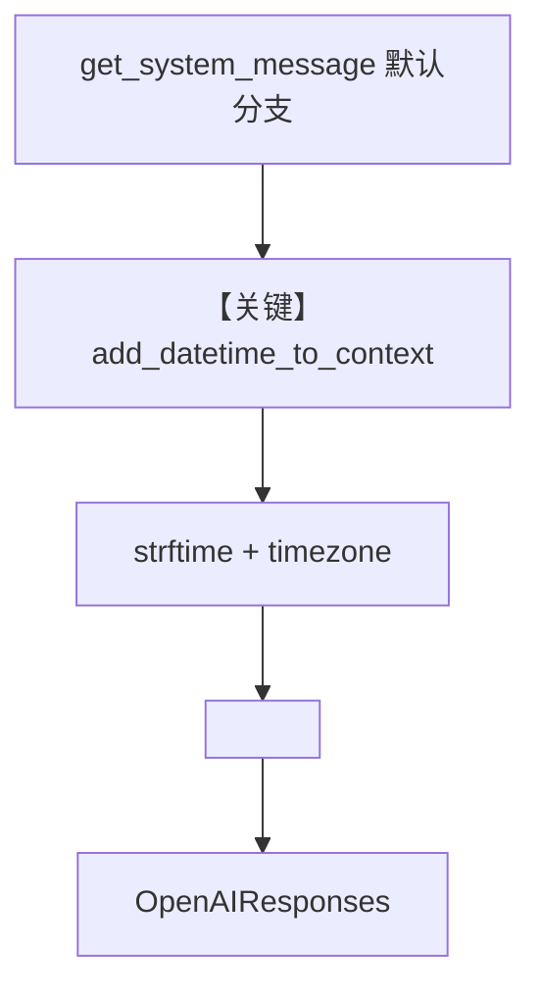

# datetime_format.py — 实现原理分析

<!-- cookbook-py-source:start -->
## 完整源码

```python
"""
Custom Datetime Format
======================

Customize the datetime format injected into the team's system context.
"""

from agno.agent import Agent
from agno.models.openai import OpenAIResponses
from agno.team import Team

# ---------------------------------------------------------------------------
# Create Members
# ---------------------------------------------------------------------------
scheduler = Agent(
    name="Scheduler",
    model=OpenAIResponses(id="gpt-5-mini"),
    role="Schedule meetings and events based on the current time.",
)

# ---------------------------------------------------------------------------
# Create Team
# ---------------------------------------------------------------------------
scheduling_team = Team(
    name="Scheduling Team",
    model=OpenAIResponses(id="gpt-5-mini"),
    members=[scheduler],
    add_datetime_to_context=True,
    datetime_format="%B %d, %Y %I:%M %p %Z",  # Human-readable format (e.g., March 09, 2026 02:30 PM UTC)
    timezone_identifier="US/Eastern",
)

# ---------------------------------------------------------------------------
# Run Team
# ---------------------------------------------------------------------------
if __name__ == "__main__":
    scheduling_team.print_response(
        "Schedule a standup meeting for 30 minutes from now.", stream=True
    )
```

<!-- cookbook-py-source:end -->

> 源文件：`cookbook/03_teams/09_context_management/datetime_format.py`

## 概述

本示例展示 Agno 的 **`add_datetime_to_context` + `datetime_format` + `timezone_identifier`** 机制：在默认 Team system 的 `additional_information` 中注入一句「当前时间」，并按指定 strftime 格式与可选时区计算。

**核心配置一览：**

| 配置项 | 值 | 说明 |
|--------|------|------|
| `name` | `"Scheduling Team"` | Team 名称 |
| `model` | `OpenAIResponses(id="gpt-5-mini")` | Responses API |
| `members` | `[scheduler]` | 单成员 |
| `add_datetime_to_context` | `True` | 启用时间注入 |
| `datetime_format` | `"%B %d, %Y %I:%M %p %Z"` | 人类可读格式 |
| `timezone_identifier` | `"US/Eastern"` | `ZoneInfo` 时区 |
| `instructions` / `description` | `None` | 未设置 |

## 核心组件解析

### 时间注入逻辑

`get_system_message()` 默认分支 L415-436（`agno/team/_messages.py`）：

- 若 `timezone_identifier` 合法，用 `ZoneInfo` 计算 `datetime.now(tz)`；
- 若提供 `datetime_format`，`strftime`；否则 `str(time)`；
- 追加到 `additional_information`：`"The current time is {formatted_time}."`

### 运行机制与因果链

1. **路径**：时间字符串进入 `_build_trailing_sections` 的 `<additional_information>` 列表项，再并入 system。
2. **状态**：无持久化；每次 run 重算当前时间。
3. **分支**：`add_datetime_to_context=False` 则不注入；时区非法则回退 `datetime.now()` 并打 warning。
4. **定位**：在 **Team** 上与单 Agent 行为一致，区别是外层仍有 `<team_members>` 等 Team 模板。

## System Prompt 组装

| 序号 | 组成部分 | 本文件中的值/来源 | 是否生效 |
|------|---------|-----------------|---------|
| 1 | 默认 Team 模板 | `_build_team_context` 等 | 是 |
| 2 | `additional_information` 时间行 | 运行时格式化 | 是 |

### 还原后的完整 System 文本

时间串**依赖运行时**，无法静态固定，结构为：

```text
The current time is <strftime 结果>.
```

示例格式注释来自 cookbook：`March 09, 2026 02:30 PM UTC` 为说明用；实际 `%Z` 在 US/Eastern 下为东部时区缩写。验证：在 `get_system_message` 返回前打印 `Message.content`。

### 段落释义

- 让队长安排「30 分钟后」等相对时间时有共同参考钟面。

## 完整 API 请求

```python
client.responses.create(model="gpt-5-mini", input=formatted_input)
```

## Mermaid 流程图



## 关键源码文件索引

| 文件 | 关键函数/类 | 作用 |
|------|------------|------|
| `agno/team/_messages.py` | `get_system_message()` L415-436 | 时间注入 |
