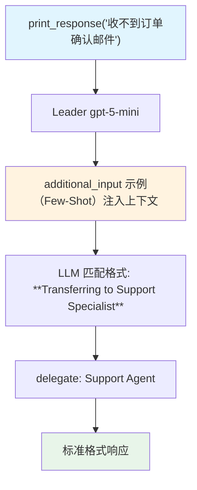

# few_shot_learning.py — 实现原理分析

> 源文件：`cookbook/03_teams/09_context_management/few_shot_learning.py`

## 概述

本示例展示 Agno Team 的 **`additional_input` Few-Shot 示例注入**：将预构建的 `support_examples`（`list[Message]`）作为 `additional_input` 传入，这些示例（用户问题+标准助手响应格式）被附加到每次请求的上下文中，引导 LLM 以固定的专业格式处理客服场景。

**核心配置一览：**

| 配置项 | 值 | 说明 |
|--------|------|------|
| `additional_input` | `support_examples`（`list[Message]`） | Few-Shot 示例消息列表 |
| `add_name_to_context` | `True` | 在上下文中包含 Team 名称 |
| `members` | `[support_agent, escalation_agent]` | 支持+升级两名成员 |

## 核心组件解析

### `additional_input` vs `additional_context`

| 特性 | `additional_context` | `additional_input` |
|------|---------------------|-------------------|
| 类型 | `str` | `list[Message]` |
| 格式 | 文本段落 | 对话消息（含 role） |
| 用途 | 单条上下文信息 | Few-Shot 对话示例 |
| 注入位置 | 系统提示 | 消息历史（user/assistant 轮次） |

### Few-Shot 的效果

3个示例覆盖了：
1. 密码重置 → 支持专家
2. 双重收费 → 升级管理器（优先级问题）
3. 应用崩溃 → 技术故障

LLM 通过这些示例学会：响应格式（**Transferring to...**）、处理问题的结构（问题描述+预期结果）。

## Mermaid 流程图

## 关键源码文件索引

| 文件 | 关键函数/类 | 作用 |
|------|------------|------|
| `agno/team/team.py` | `additional_input`, `add_name_to_context` | Few-Shot 和上下文配置 |
| `agno/models/message.py` | `Message` | 消息对象（role + content） |
