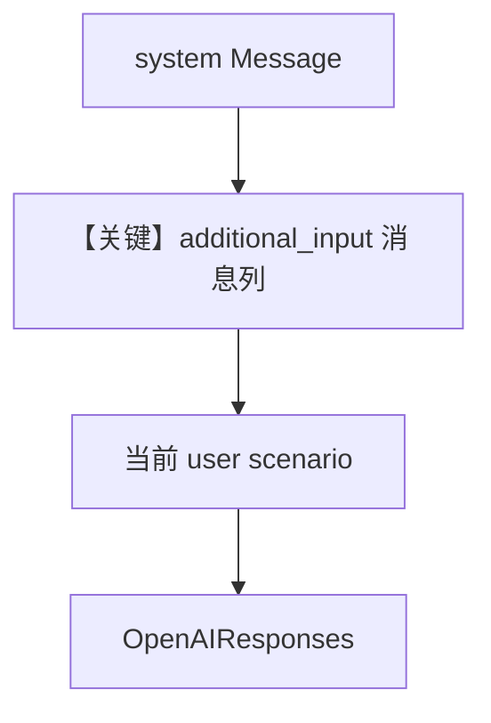

# few_shot_learning.py — 实现原理分析

<!-- cookbook-py-source:start -->
## 完整源码

```python
"""
Few Shot Learning
=============================

Demonstrates using additional_input examples to guide team support responses.
"""

from agno.agent import Agent
from agno.models.message import Message
from agno.models.openai import OpenAIResponses
from agno.team import Team

# ---------------------------------------------------------------------------
# Setup
# ---------------------------------------------------------------------------
support_examples = [
    Message(role="user", content="I forgot my password and can't log in"),
    Message(
        role="assistant",
        content="""
    I'll help you reset your password right away.

    **Transferring to Support Specialist**: Please assist this customer with password reset:
    - Guide them through the password reset process
    - Verify their identity if needed
    - Ensure they can successfully log in
    - Provide tips for creating a secure password

    Expected outcome: Customer successfully logs in with new password.
    """.strip(),
    ),
    Message(
        role="user",
        content="I've been charged twice for the same order and your chat bot couldn't help!",
    ),
    Message(
        role="assistant",
        content="""
        I sincerely apologize for the billing issue and the frustration with our chat system.

        **Transferring to Escalation Manager**: Priority billing issue requiring immediate attention:
        - Customer charged twice for same order
        - Previous automated support was unsuccessful
        - Customer is understandably frustrated
        - Needs immediate resolution and possible compensation

        Expected outcome: Billing corrected, customer satisfaction restored, and follow-up to prevent recurrence.
        """.strip(),
    ),
    Message(role="user", content="Your app keeps crashing when I try to upload photos"),
    Message(
        role="assistant",
        content="""
    I'm sorry you're experiencing crashes with photo uploads. Let me get this resolved for you.

    **Transferring to Support Specialist**: Technical issue with photo upload feature:
    - App crashes during photo upload process
    - Need to troubleshoot device compatibility and app version
    - Provide workaround solutions if available
    - Escalate to technical team if it's a known bug

    Expected outcome: Upload feature working properly or clear timeline for fix provided.
        """.strip(),
    ),
]

# ---------------------------------------------------------------------------
# Create Members
# ---------------------------------------------------------------------------
support_agent = Agent(
    name="Support Specialist",
    role="Handle customer inquiries",
    model=OpenAIResponses(id="gpt-5-mini"),
    instructions=[
        "You are a helpful customer support specialist.",
        "Always be polite, professional, and solution-oriented.",
    ],
)

escalation_agent = Agent(
    name="Escalation Manager",
    role="Handle complex issues",
    model=OpenAIResponses(id="gpt-5-mini"),
    instructions=[
        "You handle escalated customer issues that require management attention.",
        "Focus on customer satisfaction and finding solutions.",
    ],
)

# ---------------------------------------------------------------------------
# Create Team
# ---------------------------------------------------------------------------
team = Team(
    name="Customer Support Team",
    members=[support_agent, escalation_agent],
    model=OpenAIResponses(id="gpt-5-mini"),
    add_name_to_context=True,
    additional_input=support_examples,
    instructions=[
        "You coordinate customer support with excellence and empathy.",
        "Follow established patterns for proper issue resolution.",
        "Always prioritize customer satisfaction and clear communication.",
    ],
    markdown=True,
)

# ---------------------------------------------------------------------------
# Run Team
# ---------------------------------------------------------------------------
if __name__ == "__main__":
    scenarios = [
        "I can't find my order confirmation email",
        "The product I received is damaged",
        "I want to cancel my subscription but the website won't let me",
    ]

    for i, scenario in enumerate(scenarios, 1):
        print(f"Scenario {i}: {scenario}")
        print("-" * 50)
        team.print_response(scenario)
```

<!-- cookbook-py-source:end -->

> 源文件：`cookbook/03_teams/09_context_management/few_shot_learning.py`

## 概述

本示例展示 Agno 的 **`additional_input`（Few-shot 对话示例）** 机制：将多轮 `Message` 作为「额外消息」插入 `RunMessages`，在 user 主问题之前为队长提供转交模式与语气范例。

**核心配置一览：**

| 配置项 | 值 | 说明 |
|--------|------|------|
| `name` | `"Customer Support Team"` | Team 名称 |
| `model` | `OpenAIResponses(id="gpt-5-mini")` | Responses API |
| `members` | `[support_agent, escalation_agent]` | 支持专员 + 升级经理 |
| `add_name_to_context` | `True` | 注入队名 |
| `additional_input` | `support_examples`（多条 user/assistant `Message`） | Few-shot |
| `instructions` | 三条协调/同理心指令 | 队长行为 |
| `markdown` | `True` | Markdown 提示 |
| `db` | `None` | 未设置 |

## 核心组件解析

### `additional_input` 插入位置

`_get_run_messages()`（`agno/team/_messages.py` L828-847）在 system 之后、历史与用户之前，将 `team.additional_input` 中的 `Message` 逐项 `append` 到 `run_messages.messages`，并同步到 `run_response.additional_input`。

### 运行机制与因果链

1. **路径**：system → **few-shot 多轮** →（无 db 则无历史）→ 当前用户 scenario。
2. **状态**：无 session 持久化；每轮 `print_response` 仍带同一批 `additional_input`（固定范例）。
3. **分支**：无 `additional_input` 则仅有用户单轮。
4. **定位**：相对「纯 instructions」，用 **对话形态** 约束委托与措辞。

## System Prompt 组装

Few-shot **不在** `get_system_message` 字符串内，而在 **消息列表** 中。

| 序号 | 组成部分 | 本文件 | 是否生效 |
|------|---------|--------|---------|
| 1 | Team 默认 system | 含 `<team_members>` 等 | 是 |
| 2 | `additional_input` | 独立 `Message` 序列 | 是（并行于 system，属 messages） |

### 还原后的完整 System 文本

队长 `instructions` 字面量：

```text
You coordinate customer support with excellence and empathy.
Follow established patterns for proper issue resolution.
Always prioritize customer satisfaction and clear communication.
```

Few-shot 正文较长，**均来自** `support_examples` 中 `Message.content` 字段（见 `.py` 源文件 L17-64），应原样对照源码；此处不重复整卷。

### 段落释义

- Few-shot 展示「先共情 → 再 **Transferring to …**」的模板。
- Team `instructions` 要求协调与满意度优先。

### 与 User 消息的边界

每个 scenario 字符串为当前 **user**；其前为 assistant/user 交替的范例消息。

## 完整 API 请求

```python
client.responses.create(
    model="gpt-5-mini",
    input=formatted_input,
    # input 序列含：developer(system)、few-shot 多轮、最后 user scenario
)
```

## Mermaid 流程图


```mermaid
flowchart TD
    S["system Message"] --> F["【关键】additional_input 消息列"]
    F --> U["当前 user scenario"]
    U --> L["OpenAIResponses"]
```

## 关键源码文件索引

| 文件 | 关键函数/类 | 作用 |
|------|------------|------|
| `agno/team/_messages.py` | `_get_run_messages()` L828-847 | 附加 additional_input |
