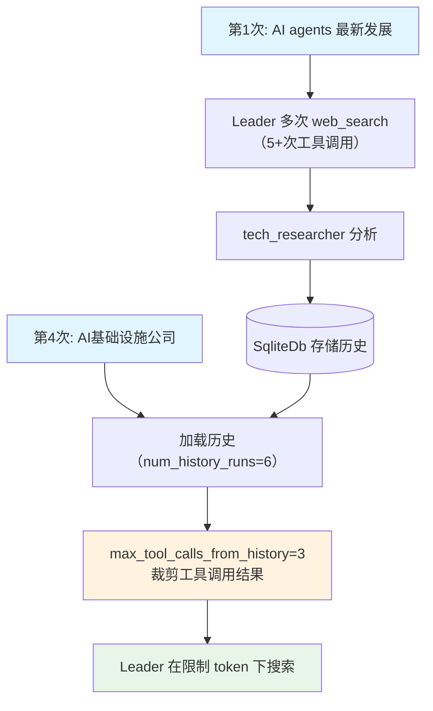

# filter_tool_calls_from_history.py — 实现原理分析

> 源文件：`cookbook/03_teams/09_context_management/filter_tool_calls_from_history.py`

## 概述

本示例展示 Agno Team 的 **`max_tool_calls_from_history` 历史工具调用过滤**：Team 使用 WebSearchTools 搜索大量信息，每次运行历史中含大量工具调用结果（大 token 消耗）。`max_tool_calls_from_history=3` 限制从历史中最多带入3条工具调用结果，避免上下文 token 爆炸，同时保留最有价值的历史信息。

**核心配置一览：**

| 配置项 | 值 | 说明 |
|--------|------|------|
| `max_tool_calls_from_history` | `3` | 历史工具调用条数上限 |
| `num_history_runs` | `6` | 历史运行次数 |
| `add_history_to_context` | `True` | 注入历史 |
| `tools` | `[WebSearchTools()]` | Leader 级搜索工具 |
| `members` | `[tech_researcher, business_analyst]` | 技术+商业分析师 |

## 核心组件解析

### 问题背景：工具调用结果的 token 消耗

每次 `WebSearchTools` 搜索返回的结果可能有数千 token。当 `num_history_runs=6` 时，历史中可能包含数十次搜索的完整结果，token 消耗可能超出模型上下文窗口。

### `max_tool_calls_from_history` 的裁剪策略

```
历史中工具调用: [search1, search2, search3, search4, ..., search_n]
max_tool_calls_from_history=3 → 只保留最近3条
```

框架从历史末尾（最近）向前选取最多3条工具调用，其余工具调用结果从历史中剔除（消息本身保留，但 `tool_call` 内容被省略）。

### Leader 工具 vs 成员工具

此例 `WebSearchTools` 挂在 **Team Leader** 上（`Team.tools`），Leader 自行搜索后再委托专家成员深度分析。

## Mermaid 流程图



## 关键源码文件索引

| 文件 | 关键函数/类 | 作用 |
|------|------------|------|
| `agno/team/team.py` | `max_tool_calls_from_history` | 历史工具调用过滤 |
