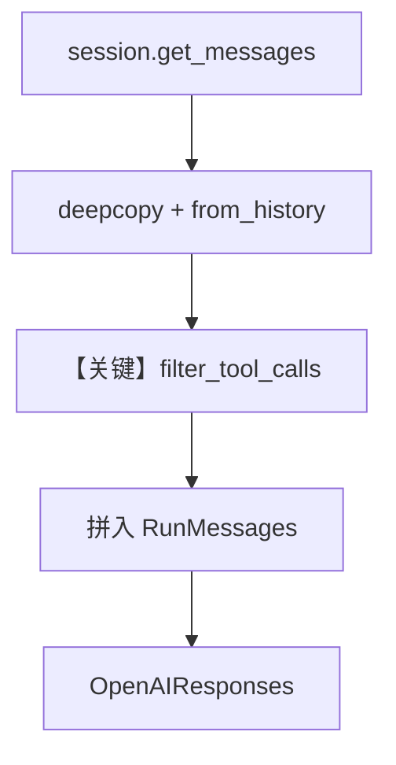

# filter_tool_calls_from_history.py — 实现原理分析

> 源文件：`cookbook/03_teams/09_context_management/filter_tool_calls_from_history.py`

## 概述

本示例展示 Agno 的 **`max_tool_calls_from_history`** 与 **`add_history_to_context`** 组合：从会话读取历史消息后，用 `filter_tool_calls` 限制保留的工具调用次数，避免长对话中工具轨迹挤占上下文。

**核心配置一览：**

| 配置项 | 值 | 说明 |
|--------|------|------|
| `name` | `"Research Team"` | Team 名称 |
| `model` | `OpenAIResponses(id="gpt-5.2")` | Responses API |
| `members` | `[tech_researcher, business_analyst]` | 两名分析师 |
| `tools` | `[WebSearchTools()]` | 队长联网搜索 |
| `description` | 见源码 | 团队描述 |
| `instructions` | `dedent(...)` 长协调流程 | 队长 |
| `db` | `SqliteDb(db_file="tmp/research_team.db")` | 持久会话 |
| `session_id` | `"research_session"` | 会话键 |
| `add_history_to_context` | `True` | 拉历史 |
| `num_history_runs` | `6` | 历史深度 |
| `max_tool_calls_from_history` | `3` | **【关键】历史工具截断** |
| `markdown` | `True` | Markdown |
| `show_members_responses` | `True` | 显示成员输出 |

## 核心组件解析

### 历史中的工具过滤

`_get_run_messages`（`agno/team/_messages.py` L864-886）在 `session.get_messages` 后：

```879:881:libs/agno/agno/team/_messages.py
            if team.max_tool_calls_from_history is not None:
                filter_tool_calls(history_copy, team.max_tool_calls_from_history)
```

### 运行机制与因果链

1. **路径**：DB 取历史 → 深拷贝 → `filter_tool_calls` → 拼入本轮 messages → 用户问题。
2. **状态**：`tmp/research_team.db` 持久化多轮 run；重复执行会延续同 `session_id`。
3. **分支**：`max_tool_calls_from_history=None` 则不过滤工具调用块。
4. **定位**：在「带搜索的 Team + 历史」场景下控制 **工具噪声**。

## System Prompt 组装

| 组成部分 | 本文件 | 是否生效 |
|---------|--------|---------|
| `description` + `instructions` | 是 | 是 |
| `markdown` | 是 | 是 |

`instructions` 全文见 `.py` 中 `dedent("""...""")`，还原须直接复制该块。

### 与 User 消息的边界

用户研究问题为 user；历史中的 tool/assistant 经过滤后进入上下文。

## 完整 API 请求

```python
client.responses.create(
    model="gpt-5.2",
    input=formatted_input,
    tools=formatted_tools,
)
```

## Mermaid 流程图


```mermaid
flowchart TD
    H["session.get_messages"] --> C["deepcopy + from_history"]
    C --> F["【关键】filter_tool_calls"]
    F --> R["拼入 RunMessages"]
    R --> A["OpenAIResponses"]
```

## 关键源码文件索引

| 文件 | 关键函数/类 | 作用 |
|------|------------|------|
| `agno/team/_messages.py` | `_get_run_messages` L864-886 | 历史 + 工具过滤 |
| `agno/utils/message.py` | `filter_tool_calls` | 截断实现 |
