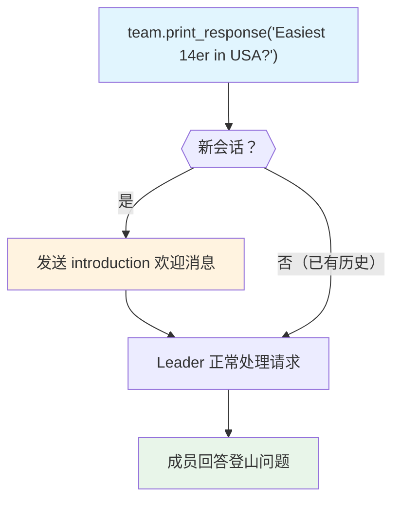

# introduction.py — 实现原理分析

> 源文件：`cookbook/03_teams/09_context_management/introduction.py`

## 概述

本示例展示 Agno Team 的 **`introduction` 首次会话欢迎消息**：配置 `introduction` 字符串后，Team 在新会话的第一次响应前发送该欢迎消息，明确告知用户 Team 的功能范围（如"只回答登山相关问题"），后续对话则正常进行。

**核心配置一览：**

| 配置项 | 值 | 说明 |
|--------|------|------|
| `introduction` | `"Hello, I'm your personal assistant..."` | 首次响应欢迎语 |
| `session_id` | `"introduction_session_mountain_climbing"` | 固定会话ID |
| `add_history_to_context` | `True` | 历史上下文注入 |
| `db` | `SqliteDb` | 持久化存储 |

## 核心组件解析

### `introduction` 的触发时机

`introduction` 仅在**新会话的首次交互**时发送，作为 assistant 消息插入到响应流的开头。对于已存在历史记录的会话，不会重复发送。

### 使用场景

- **功能声明**：明确 Team 只处理特定领域问题（如"我只回答登山相关问题"）
- **用户引导**：告知用户如何与 Team 交互
- **法规合规**：在对话开始时发送免责声明

### 固定 `session_id` 的注意事项

硬编码 `session_id` 意味着所有运行共享同一会话，适合演示；生产环境应为每个用户生成唯一 `session_id`。

## Mermaid 流程图

## 关键源码文件索引

| 文件 | 关键函数/类 | 作用 |
|------|------------|------|
| `agno/team/team.py` | `introduction` | 首次会话欢迎消息 |
