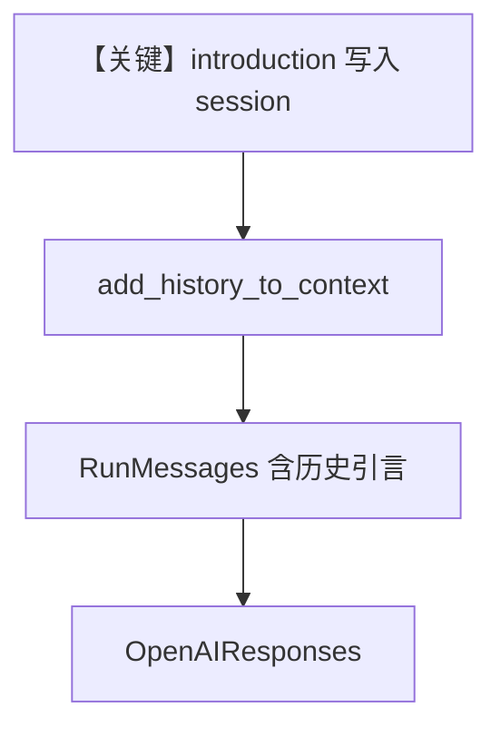

# introduction.py — 实现原理分析

> 源文件：`cookbook/03_teams/09_context_management/introduction.py`

## 概述

本示例展示 Agno 的 **`introduction`** 机制：在**会话创建/加载**时向会话注入一条「开场白」式 assistant 消息，限定话题范围（仅登山相关），配合 `add_history_to_context` 使后续轮次仍能看到该引言。

**核心配置一览：**

| 配置项 | 值 | 说明 |
|--------|------|------|
| `model` | `OpenAIResponses(id="gpt-5.2")` | 队长与成员共用默认 |
| `db` | `SqliteDb(db_file="tmp/teams.db", session_table="team_sessions")` | 持久化 |
| `members` | `[agent]` | 单成员，无额外参数 |
| `introduction` | `INTRODUCTION` 常量字符串 | 开场白 |
| `session_id` | `"introduction_session_mountain_climbing"` | 会话 |
| `add_history_to_context` | `True` | 历史进上下文 |

## 核心组件解析

### 引言写入会话

`agno/team/_storage.py`（约 L265-276、L332-343）在会话初始化时若 `team.introduction is not None`，写入一条内容等于 `introduction` 的消息（角色为 `team.model.assistant_message_role`），使首屏即呈现助手自我介绍。

### 运行机制与因果链

1. **路径**：首次 run 建会话 → 引言入库 → 后续 `get_messages` 将引言纳入历史 → 与 system、新 user 拼接。
2. **状态**：`tmp/teams.db`；同一 `session_id` 复跑会延续历史。
3. **分支**：无 `introduction` 则无该条 assistant。
4. **定位**：演示 **会话级冷启动语**，区别于单条 `additional_input`。

## System Prompt 组装

引言**不是** `get_system_message` 的固定字段，而是 **session 消息历史中的一条 assistant**。

| 组成部分 | 本文件 | 是否生效 |
|---------|--------|---------|
| Team 默认 system | 是 | 是 |
| `introduction` | 作为历史消息 | 是（经 add_history） |

### 还原后的完整 System 文本

引言常量（字面量）：

```text
Hello, I'm your personal assistant. I can help you only with questions related to mountain climbing.
```

完整默认 system 仍含 Team 模板；需运行时打印合并效果。

### 段落释义

- 强行收窄助手职责到登山话题，后续用户问题若偏离，模型应依引言拒绝或引导。

## 完整 API 请求

```python
client.responses.create(model="gpt-5.2", input=formatted_input)
```

## Mermaid 流程图


```mermaid
flowchart TD
    I["【关键】introduction 写入 session"] --> H["add_history_to_context"]
    H --> M["RunMessages 含历史引言"]
    M --> L["OpenAIResponses"]
```

## 关键源码文件索引

| 文件 | 关键函数/类 | 作用 |
|------|------------|------|
| `agno/team/_storage.py` | introduction 分支 L265+ | 会话首条 assistant |
| `agno/team/_messages.py` | `_get_run_messages` 历史段 | 合并历史 |
