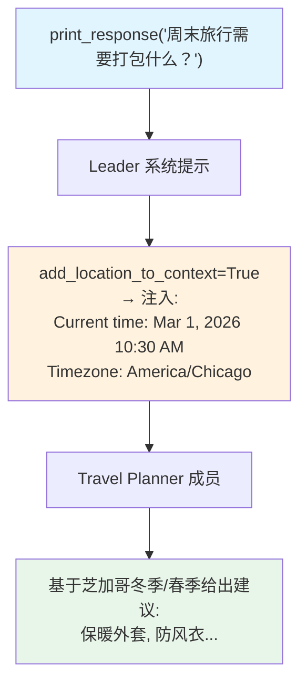

# location_context.py — 实现原理分析

> 源文件：`cookbook/03_teams/09_context_management/location_context.py`

## 概述

本示例展示 Agno Team 的 **`add_location_to_context` + `timezone_identifier` 地理时区上下文**：启用后，当前本地时间（基于指定时区）和位置信息自动注入 Leader 系统提示，使 Team 能基于"现在是芝加哥时区的冬季上午"等信息提供时间/季节相关的建议。

**核心配置一览：**

| 配置项 | 值 | 说明 |
|--------|------|------|
| `add_location_to_context` | `True` | 启用位置/时间注入 |
| `timezone_identifier` | `"America/Chicago"` | 时区标识符（IANA） |
| `members` | `[planner]`（Travel Planner） | 旅行建议成员 |

## 核心组件解析

### 注入的上下文内容

启用后，系统提示中会追加类似：

```
Current time: Monday, March 01, 2026 10:30 AM
Timezone: America/Chicago (UTC-6)
```

LLM 可据此推断当前季节（冬季→需要保暖装备）、时区（影响活动时间建议）。

### `timezone_identifier` 格式

使用 IANA 时区标识符（如 `"America/Chicago"`、`"Asia/Shanghai"`、`"Europe/London"`），框架通过 `zoneinfo` 或 `pytz` 将 UTC 时间转换为本地时间。

### 适用场景

- 旅行推荐（季节性建议）
- 活动规划（营业时间、日落时间）
- 客户服务（根据当地时间问候）

## Mermaid 流程图



## 关键源码文件索引

| 文件 | 关键函数/类 | 作用 |
|------|------------|------|
| `agno/team/team.py` | `add_location_to_context`, `timezone_identifier` | 地理时区上下文配置 |
