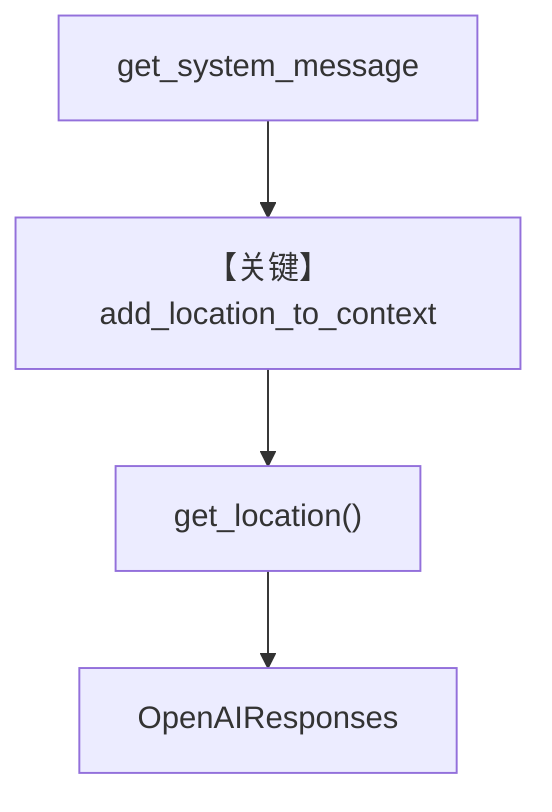

# location_context.py — 实现原理分析

<!-- cookbook-py-source:start -->
## 完整源码

```python
"""
Location Context
================

Demonstrates adding location and timezone context to team prompts.
"""

from agno.agent import Agent
from agno.models.openai import OpenAIResponses
from agno.team import Team

# ---------------------------------------------------------------------------
# Create Members
# ---------------------------------------------------------------------------
planner = Agent(
    name="Travel Planner",
    model=OpenAIResponses(id="gpt-5-mini"),
    instructions=[
        "Use location context in recommendations.",
        "Keep suggestions concise and practical.",
    ],
)


# ---------------------------------------------------------------------------
# Create Team
# ---------------------------------------------------------------------------
trip_planner_team = Team(
    name="Trip Planner",
    model=OpenAIResponses(id="gpt-5-mini"),
    members=[planner],
    add_location_to_context=True,
    timezone_identifier="America/Chicago",
    instructions=[
        "Plan recommendations around local time and season.",
        "Mention when local timing may affect itinerary decisions.",
    ],
)


# ---------------------------------------------------------------------------
# Run Team
# ---------------------------------------------------------------------------
if __name__ == "__main__":
    trip_planner_team.print_response(
        "What should I pack for a weekend trip based on local time and climate context?",
        stream=True,
    )
```

<!-- cookbook-py-source:end -->

> 源文件：`cookbook/03_teams/09_context_management/location_context.py`

## 概述

本示例展示 Agno 的 **`add_location_to_context`** 与 **`timezone_identifier`**：在 `additional_information` 中注入近似地理位置（`get_location()`），并配合成员/队长指令做本地化行程建议。

**核心配置一览：**

| 配置项 | 值 | 说明 |
|--------|------|------|
| `name` | `"Trip Planner"` | Team 名称 |
| `model` | `OpenAIResponses(id="gpt-5-mini")` | Responses API |
| `members` | `[planner]` | 旅行规划成员 |
| `add_location_to_context` | `True` | 启用位置行 |
| `timezone_identifier` | `"America/Chicago"` | 时区（与时间行共用机制） |
| `instructions` | 两条队长指令 | 本地时节与行程 |

注意：`add_datetime_to_context` 未设为 True，故**仅**当其他逻辑未加时间时，本例可能只有 location 行；`timezone_identifier` 仍影响**若**开启 `add_datetime_to_context` 时的时区。当前文件未开 `add_datetime_to_context`，`timezone_identifier` 对时间行无贡献，但保留在 Team 上供扩展。

## 核心组件解析

### 位置行

`get_system_message` L438-448：若 `get_location()` 返回城市/区域/国家，则追加  
`Your approximate location is: <city, region, country>.`

### 运行机制与因果链

1. **路径**：位置字符串进入 `<additional_information>`，再进 system。
2. **状态**：`get_location()` 依赖运行环境，结果不固定。
3. **定位**：与 `datetime_format.py` 对称，强调 **地理语境**。

## System Prompt 组装

队长 `instructions` 字面：

```text
Plan recommendations around local time and season.
Mention when local timing may affect itinerary decisions.
```

成员 `instructions`：

```text
Use location context in recommendations.
Keep suggestions concise and practical.
```

### 还原后的完整 System 文本

位置行**运行时**确定，结构：

```text
Your approximate location is: <...>.
```

## 完整 API 请求

```python
client.responses.create(model="gpt-5-mini", input=formatted_input)
```

## Mermaid 流程图


```mermaid
flowchart TD
    G["get_system_message"] --> L["【关键】add_location_to_context"]
    L --> A["get_location()"]
    A --> M["OpenAIResponses"]
```

## 关键源码文件索引

| 文件 | 关键函数/类 | 作用 |
|------|------------|------|
| `agno/team/_messages.py` | L438-448 | 位置注入 |
