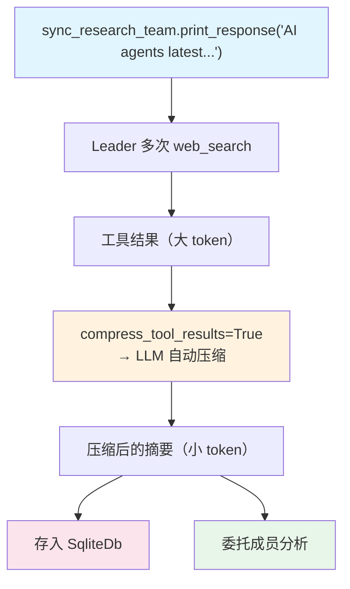

# tool_call_compression.py — 实现原理分析

> 源文件：`cookbook/03_teams/10_context_compression/tool_call_compression.py`

## 概述

本示例展示 Agno Team 的 **`compress_tool_results` 自动工具结果压缩**：Team 使用 WebSearchTools 搜索大量信息，`compress_tool_results=True` 启用后，框架自动用 LLM 压缩历史中的工具调用结果（减少 token），同时保留关键信息。分别演示了同步（`print_response`）和异步（`aprint_response`）两种工作流。

**核心配置一览：**

| 配置项 | 值 | 说明 |
|--------|------|------|
| `compress_tool_results` | `True` | 自动压缩工具调用结果 |
| `tools` | `[WebSearchTools()]` | Leader 级搜索工具（产生大量结果） |
| `db` | `SqliteDb` | 持久化（压缩结果也存储） |
| `members` | `[tech_researcher, business_analyst]` | 技术+商业分析师 |

## 核心组件解析

### `compress_tool_results` 的工作机制

当历史中的工具调用结果累积到一定量时，框架自动触发压缩：

1. 收集历史中的工具调用结果
2. 用 LLM 生成摘要版本（保留关键信息，去除冗余）
3. 用摘要替换原始结果，减少后续请求的 token 消耗

### 与 `max_tool_calls_from_history` 的区别

| 策略 | 方法 | 信息保留 |
|------|------|---------|
| `max_tool_calls_from_history=N` | 丢弃旧的工具调用 | 完全丢失旧结果 |
| `compress_tool_results=True` | LLM 摘要压缩 | 保留关键信息，减少 token |

### 同步 vs 异步压缩

压缩逻辑在两种模式下均工作，`async_research_team` 演示异步场景下的压缩效果。

## Mermaid 流程图

## 关键源码文件索引

| 文件 | 关键函数/类 | 作用 |
|------|------------|------|
| `agno/team/team.py` | `compress_tool_results` | 自动工具结果压缩开关 |
| `agno/compression/` | 压缩逻辑实现 | LLM 驱动的工具结果摘要 |
