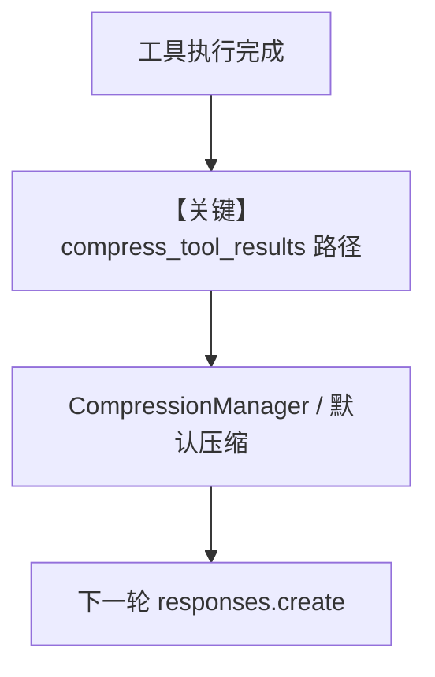

# tool_call_compression.py — 实现原理分析

<!-- cookbook-py-source:start -->
## 完整源码

```python
"""
Tool Call Compression
=============================

Demonstrates team-level tool result compression in both sync and async workflows.
"""

import asyncio
from textwrap import dedent

from agno.agent import Agent
from agno.db.sqlite import SqliteDb
from agno.models.openai import OpenAIResponses
from agno.team import Team
from agno.tools.websearch import WebSearchTools

# ---------------------------------------------------------------------------
# Create Members
# ---------------------------------------------------------------------------
sync_tech_researcher = Agent(
    name="Alex",
    role="Technology Researcher",
    model=OpenAIResponses(id="gpt-5.2"),
    instructions=dedent("""
        You specialize in technology and AI research.
        - Focus on latest developments, trends, and breakthroughs
        - Provide concise, data-driven insights
        - Cite your sources
    """).strip(),
)

sync_business_analyst = Agent(
    name="Sarah",
    role="Business Analyst",
    model=OpenAIResponses(id="gpt-5.2"),
    instructions=dedent("""
        You specialize in business and market analysis.
        - Focus on companies, markets, and economic trends
        - Provide actionable business insights
        - Include relevant data and statistics
    """).strip(),
)

async_tech_specialist = Agent(
    name="Tech Specialist",
    role="Technology Researcher",
    model=OpenAIResponses(id="gpt-5.2"),
    instructions=dedent("""
        You specialize in technology and AI research.
        - Focus on latest developments, trends, and breakthroughs
        - Provide concise, data-driven insights
        - Cite your sources
    """).strip(),
)

async_business_analyst = Agent(
    name="Sarah",
    role="Business Analyst",
    model=OpenAIResponses(id="gpt-5.2"),
    instructions=dedent("""
        You specialize in business and market analysis.
        - Focus on companies, markets, and economic trends
        - Provide actionable business insights
        - Include relevant data and statistics
    """).strip(),
)

# ---------------------------------------------------------------------------
# Create Team
# ---------------------------------------------------------------------------
sync_research_team = Team(
    name="Research Team",
    model=OpenAIResponses(id="gpt-5.2"),
    members=[sync_tech_researcher, sync_business_analyst],
    tools=[WebSearchTools()],  # Team uses DuckDuckGo for research
    description="Research team that investigates topics and provides analysis.",
    instructions=dedent("""
        You are a research coordinator that investigates topics comprehensively.

        Your Process:
        1. Use DuckDuckGo to search for a lot of information on the topic.
        2. Delegate detailed analysis to the appropriate specialist
        3. Synthesize research findings with specialist insights

        Guidelines:
        - Always start with web research using your DuckDuckGo tools. Try to get as much information as possible.
        - Choose the right specialist based on the topic (tech vs business)
        - Combine your research with specialist analysis
        - Provide comprehensive, well-sourced responses
    """).strip(),
    db=SqliteDb(db_file="tmp/research_team.db"),
    compress_tool_results=True,
    show_members_responses=True,
)

async_research_team = Team(
    name="Research Team",
    model=OpenAIResponses(id="gpt-5.2"),
    members=[async_tech_specialist, async_business_analyst],
    tools=[WebSearchTools()],  # Team uses DuckDuckGo for research
    description="Research team that investigates topics and provides analysis.",
    instructions=dedent("""
        You are a research coordinator that investigates topics comprehensively.

        Your Process:
        1. Use DuckDuckGo to search for a lot of information on the topic.
        2. Delegate detailed analysis to the appropriate specialist
        3. Synthesize research findings with specialist insights

        Guidelines:
        - Always start with web research using your DuckDuckGo tools. Try to get as much information as possible.
        - Choose the right specialist based on the topic for analysis (tech vs business)
        - Combine your research with specialist analysis
        - Provide comprehensive, well-sourced responses
    """).strip(),
    db=SqliteDb(db_file="tmp/research_team2.db"),
    markdown=True,
    show_members_responses=True,
    compress_tool_results=True,
)


async def run_async_tool_compression() -> None:
    await async_research_team.aprint_response(
        "What are the latest developments in AI agents? Which companies dominate the market? Find the latest news and reports on the companies.",
        stream=True,
    )


# ---------------------------------------------------------------------------
# Run Team
# ---------------------------------------------------------------------------
if __name__ == "__main__":
    # --- Sync ---
    sync_research_team.print_response(
        "What are the latest developments in AI agents? Which companies dominate the market? Find the latest news and reports on the companies.",
        stream=True,
    )

    # --- Async ---
    asyncio.run(run_async_tool_compression())
```

<!-- cookbook-py-source:end -->

> 源文件：`cookbook/03_teams/10_context_compression/tool_call_compression.py`

## 概述

本示例展示 Agno 的 **`compress_tool_results=True`** 机制：在 Team 运行管线中启用工具结果压缩，减少长工具输出对上下文窗口的占用；同时给出 **sync / async** 两套等价 Team 配置。

**核心配置一览：**

| 配置项 | sync Team | async Team |
|--------|-----------|------------|
| `compress_tool_results` | `True` | `True` |
| `db` | `tmp/research_team.db` | `tmp/research_team2.db` |
| `markdown` | 未设置 | `True` |
| 其余 | 同左：成员、tools、description、instructions | 同左 |

## 核心组件解析

### 压缩与 CompressionManager

`agno/team/_init.py` 中 `_set_compression_manager`：当 `compress_tool_results` 为 True 且未显式提供管理器时，会创建默认 `CompressionManager`；随后在 `_run` / `_response` 路径把 `compression_manager` 传入模型调用（见 `agno/team/_run.py` 等处 `compression_manager=team.compression_manager if team.compress_tool_results else None`）。

`OpenAIResponses.invoke(..., compress_tool_results=...)`（`responses.py` L679）将压缩标志传入格式化消息路径。

### 运行机制与因果链

1. **路径**：工具返回 → 可选压缩 → 进入下一轮模型 `input`。
2. **状态**：SQLite 会话库分离，避免 sync/async 争用。
3. **定位**：与 `filter_tool_calls_from_history` 不同：后者裁剪**历史**中的工具调用，本示例侧重**即时结果**压缩策略。

## System Prompt 组装

与 `filter_tool_calls_from_history` 类似，队长 `description`/`instructions` 为长 `dedent` 文本；压缩**不改变** system 拼装，只影响工具消息内容长度。

## 完整 API 请求

```python
client.responses.create(
    model="gpt-5.2",
    input=formatted_input,
    tools=formatted_tools,
    # 内部根据 compress_tool_results 压缩 tool 结果块
)
```

## Mermaid 流程图


```mermaid
flowchart TD
    T["工具执行完成"] --> C["【关键】compress_tool_results 路径"]
    C --> M["CompressionManager / 默认压缩"]
    M --> R["下一轮 responses.create"]
```

## 关键源码文件索引

| 文件 | 作用 |
|------|------|
| `agno/team/_init.py` | `_set_compression_manager` |
| `agno/team/_run.py` | 传递 `compression_manager` |
| `agno/models/openai/responses.py` | `invoke(compress_tool_results=...)` |
