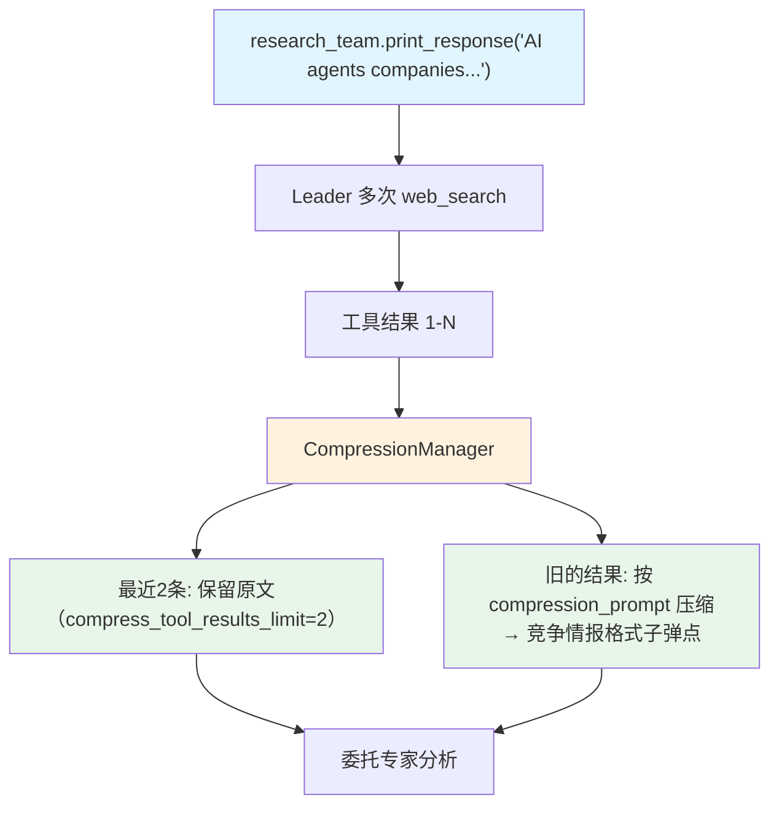

# tool_call_compression_with_manager.py — 实现原理分析

> 源文件：`cookbook/03_teams/10_context_compression/tool_call_compression_with_manager.py`

## 概述

本示例展示 Agno Team 的 **`CompressionManager` 自定义压缩策略**：相比 `compress_tool_results=True`（使用默认压缩逻辑），`CompressionManager` 允许指定专用压缩模型、自定义压缩 prompt（如"只保留竞争情报的关键数字和日期"）、以及保留最近N条工具结果不压缩（`compress_tool_results_limit`）。

**核心配置一览：**

| 配置项 | 值 | 说明 |
|--------|------|------|
| `compression_manager` | `CompressionManager(...)` | 自定义压缩管理器 |
| `CompressionManager.model` | `OpenAIResponses(id="gpt-5.2")` | 专用压缩模型 |
| `compress_tool_results_limit` | `2` | 最近2条工具结果不压缩 |
| `compress_tool_call_instructions` | `compression_prompt` | 自定义压缩指令 |

## 核心组件解析

### `CompressionManager` 的参数

```python
compression_manager = CompressionManager(
    model=OpenAIResponses(id="gpt-5.2"),
    compress_tool_results_limit=2,  # 最近2条保留原文
    compress_tool_call_instructions=compression_prompt,  # 自定义 prompt
)
```

- **`compress_tool_results_limit=2`**：最近2次搜索结果保留原始内容（避免压缩最新信息导致精度损失），更早的搜索结果才压缩
- **`compress_tool_call_instructions`**：完全控制 LLM 如何压缩，本例指示只提取竞争情报格式：`[公司] - [日期]: [行动] ([关键数字])`

### 自定义压缩 Prompt 的价值

通用压缩 vs 专业压缩的对比：

```
通用压缩: "The company announced a new product and expanded its market share..."
专业压缩: "OpenAI - Mar 2026: GPT-6 at $20/user/month, targeting enterprise"
```

专业压缩极大减少 token 同时保留分析价值。

## Mermaid 流程图



## 关键源码文件索引

| 文件 | 关键函数/类 | 作用 |
|------|------------|------|
| `agno/compression/manager.py` | `CompressionManager` | 自定义压缩管理器 |
| `agno/team/team.py` | `compression_manager` | 压缩管理器挂载点 |
