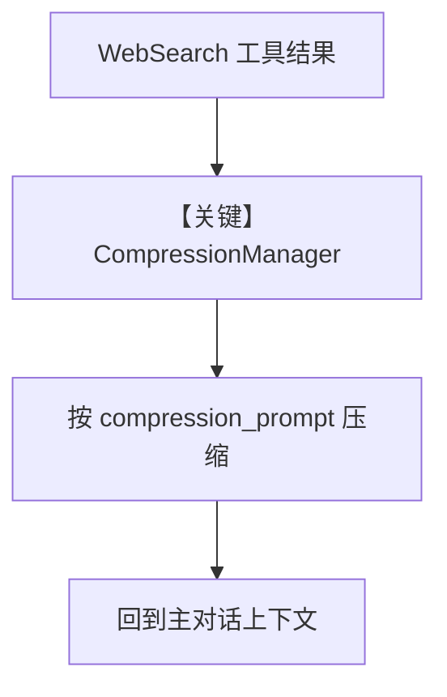

# tool_call_compression_with_manager.py — 实现原理分析

<!-- cookbook-py-source:start -->
## 完整源码

```python
"""
Tool Call Compression With Manager
==================================

Demonstrates custom tool result compression using CompressionManager.
"""

from textwrap import dedent

from agno.agent import Agent
from agno.compression.manager import CompressionManager
from agno.db.sqlite import SqliteDb
from agno.models.openai import OpenAIResponses
from agno.team import Team
from agno.tools.websearch import WebSearchTools

# ---------------------------------------------------------------------------
# Setup
# ---------------------------------------------------------------------------
compression_prompt = """
    You are a compression expert. Your goal is to compress web search results for a competitive intelligence analyst.

    YOUR GOAL: Extract only actionable competitive insights while being extremely concise.

    MUST PRESERVE:
    - Competitor names and specific actions (product launches, partnerships, acquisitions, pricing changes)
    - Exact numbers (revenue, market share, growth rates, pricing, headcount)
    - Precise dates (announcement dates, launch dates, deal dates)
    - Direct quotes from executives or official statements
    - Funding rounds and valuations

    MUST REMOVE:
    - Company history and background information
    - General industry trends (unless competitor-specific)
    - Analyst opinions and speculation (keep only facts)
    - Detailed product descriptions (keep only key differentiators and pricing)
    - Marketing fluff and promotional language

    OUTPUT FORMAT:
    Return a bullet-point list where each line follows this format:
    "[Company Name] - [Date]: [Action/Event] ([Key Numbers/Details])"

    Keep it under 200 words total. Be ruthlessly concise. Facts only.

    Example:
    - Acme Corp - Mar 15, 2024: Launched AcmeGPT at $99/user/month, targeting enterprise market
    - TechCo - Feb 10, 2024: Acquired DataStart for $150M, gaining 500 enterprise customers
"""

compression_manager = CompressionManager(
    model=OpenAIResponses(id="gpt-5.2"),
    compress_tool_results_limit=2,  # Keep only last 2 tool call results uncompressed
    compress_tool_call_instructions=compression_prompt,
)

# ---------------------------------------------------------------------------
# Create Members
# ---------------------------------------------------------------------------
tech_researcher = Agent(
    name="Alex",
    role="Technology Researcher",
    model=OpenAIResponses(id="gpt-5.2"),
    instructions=dedent("""
        You specialize in technology and AI research.
        - Focus on latest developments, trends, and breakthroughs
        - Provide concise, data-driven insights
        - Cite your sources
    """).strip(),
)

business_analyst = Agent(
    name="Sarah",
    role="Business Analyst",
    model=OpenAIResponses(id="gpt-5.2"),
    instructions=dedent("""
        You specialize in business and market analysis.
        - Focus on companies, markets, and economic trends
        - Provide actionable business insights
        - Include relevant data and statistics
    """).strip(),
)

# ---------------------------------------------------------------------------
# Create Team
# ---------------------------------------------------------------------------
research_team = Team(
    name="Research Team",
    model=OpenAIResponses(id="gpt-5.2"),
    members=[tech_researcher, business_analyst],
    tools=[WebSearchTools()],  # Team uses DuckDuckGo for research
    description="Research team that investigates topics and provides analysis.",
    instructions=dedent("""
        You are a research coordinator that investigates topics comprehensively.

        Your Process:
        1. Use DuckDuckGo to search for a lot of information on the topic.
        2. Delegate detailed analysis to the appropriate specialist
        3. Synthesize research findings with specialist insights

        Guidelines:
        - Always start with web research using your DuckDuckGo tools. Try to get as much information as possible.
        - Choose the right specialist based on the topic (tech vs business)
        - Combine your research with specialist analysis
        - Provide comprehensive, well-sourced responses
    """).strip(),
    db=SqliteDb(db_file="tmp/research_team.db"),
    show_members_responses=True,
    compression_manager=compression_manager,
)

# ---------------------------------------------------------------------------
# Run Team
# ---------------------------------------------------------------------------
if __name__ == "__main__":
    research_team.print_response(
        "What are the latest developments in AI agents? Which companies dominate the market? Find the latest news and reports on the companies.",
        stream=True,
    )
```

<!-- cookbook-py-source:end -->

> 源文件：`cookbook/03_teams/10_context_compression/tool_call_compression_with_manager.py`

## 概述

本示例展示 **自定义 `CompressionManager`**：用独立模型与长 `compress_tool_call_instructions` 定义「如何压缩网页搜索结果」，并用 `compress_tool_results_limit=2` 保留最近若干条未压缩结果。

**核心配置一览：**

| 配置项 | 值 |
|--------|-----|
| `CompressionManager` | `model=OpenAIResponses(gpt-5.2)`, `compress_tool_results_limit=2`, `compress_tool_call_instructions=compression_prompt` |
| `Team.compression_manager` | 上述实例 |
| `db` | `SqliteDb(tmp/research_team.db)` |
| 成员 / tools / instructions | 与基础 research team 相同 |

初始化逻辑会将 `compression_manager` 绑定到 Team，并在适当时开启 `compress_tool_results`（见 `agno/team/_init.py` `_set_compression_manager`）。

### 运行机制与因果链

压缩提示词（`compression_prompt`）**全文**见 `.py` L20-47，定义保留/删除字段与输出格式；运行时由 `CompressionManager` 驱动二次模型调用或同类逻辑压缩工具输出。

## System Prompt 组装

`compression_prompt` **不**进入队长 system，而是压缩器的指令；队长 system 仍为 Team 默认 + `description`/`instructions`。

## 完整 API 请求

1. 主对话：`responses.create(model="gpt-5.2", ...)`  
2. 压缩步骤：可能额外调用同一或配置的压缩模型（以 `CompressionManager` 实现为准）。

## Mermaid 流程图


```mermaid
flowchart TD
    W["WebSearch 工具结果"] --> CM["【关键】CompressionManager"]
    CM --> P["按 compression_prompt 压缩"]
    P --> N["回到主对话上下文"]
```

## 关键源码文件索引

| 文件 | 作用 |
|------|------|
| `agno/compression/manager.py` | `CompressionManager` |
| `agno/team/_init.py` | `_set_compression_manager` |
