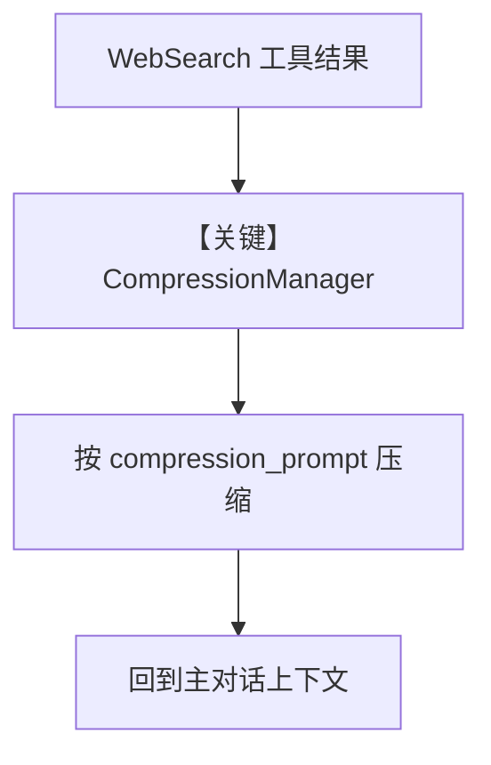

# tool_call_compression_with_manager.py — 实现原理分析

> 源文件：`cookbook/03_teams/10_context_compression/tool_call_compression_with_manager.py`

## 概述

本示例展示 **自定义 `CompressionManager`**：用独立模型与长 `compress_tool_call_instructions` 定义「如何压缩网页搜索结果」，并用 `compress_tool_results_limit=2` 保留最近若干条未压缩结果。

**核心配置一览：**

| 配置项 | 值 |
|--------|-----|
| `CompressionManager` | `model=OpenAIResponses(gpt-5.2)`, `compress_tool_results_limit=2`, `compress_tool_call_instructions=compression_prompt` |
| `Team.compression_manager` | 上述实例 |
| `db` | `SqliteDb(tmp/research_team.db)` |
| 成员 / tools / instructions | 与基础 research team 相同 |

初始化逻辑会将 `compression_manager` 绑定到 Team，并在适当时开启 `compress_tool_results`（见 `agno/team/_init.py` `_set_compression_manager`）。

### 运行机制与因果链

压缩提示词（`compression_prompt`）**全文**见 `.py` L20-47，定义保留/删除字段与输出格式；运行时由 `CompressionManager` 驱动二次模型调用或同类逻辑压缩工具输出。

## System Prompt 组装

`compression_prompt` **不**进入队长 system，而是压缩器的指令；队长 system 仍为 Team 默认 + `description`/`instructions`。

## 完整 API 请求

1. 主对话：`responses.create(model="gpt-5.2", ...)`  
2. 压缩步骤：可能额外调用同一或配置的压缩模型（以 `CompressionManager` 实现为准）。

## Mermaid 流程图

```mermaid
flowchart TD
    W["WebSearch 工具结果"] --> CM["【关键】CompressionManager"]
    CM --> P["按 compression_prompt 压缩"]
    P --> N["回到主对话上下文"]
```

## 关键源码文件索引

| 文件 | 作用 |
|------|------|
| `agno/compression/manager.py` | `CompressionManager` |
| `agno/team/_init.py` | `_set_compression_manager` |
