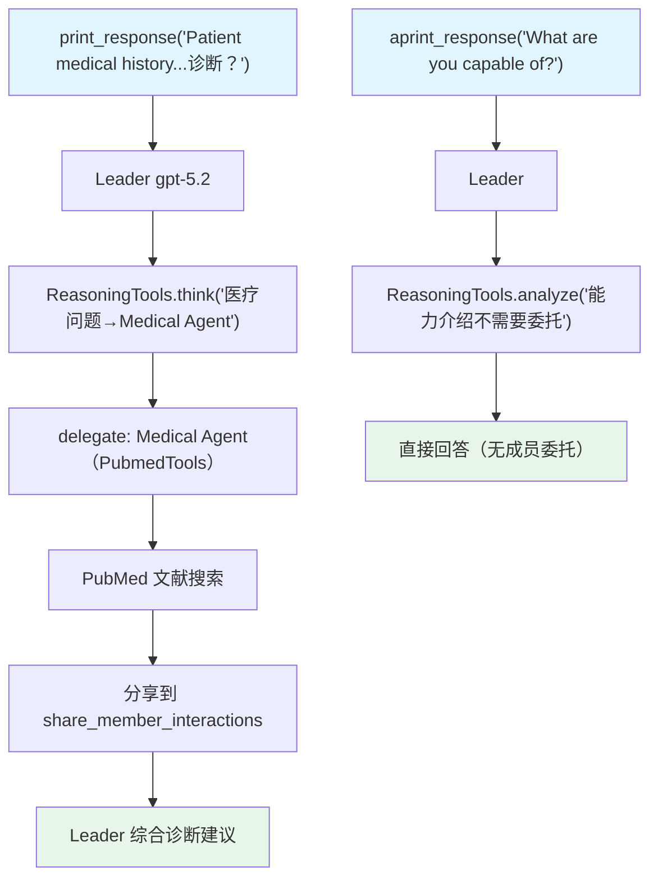

# reasoning_multi_purpose_team.py — 实现原理分析

> 源文件：`cookbook/03_teams/11_reasoning/reasoning_multi_purpose_team.py`

## 概述

本示例展示 Agno Team 的 **`ReasoningTools` + 多用途成员团队**：Leader 持有 `ReasoningTools`（链式思考工具），在委托成员前先进行结构化推理分析，判断最合适的成员（Web、Finance、Medical、Calculator、Agno Assist、Code 等8名专家），并通过 `share_member_interactions=True` 让成员间共享上下文，同时演示同步和异步两种执行路径。

**核心配置一览：**

| 配置项 | 值 | 说明 |
|--------|------|------|
| `tools` | `[ReasoningTools(add_instructions=True, add_few_shot=True)]` | Leader 级推理工具 |
| `share_member_interactions` | `True` | 成员间共享交互上下文 |
| `members` | 7-8 名多领域专家 | Web/Finance/Medical/Code/Agno/Github 等 |
| `model` | `OpenAIResponses(id="gpt-5.2")` | Leader 使用强推理模型 |

## 核心组件解析

### `ReasoningTools` 的作用

```python
tools=[ReasoningTools(add_instructions=True, add_few_shot=True)]
```

`ReasoningTools` 为 Leader 添加 `think()`、`analyze()` 等推理工具，让 Leader 在决策时先进行链式思考：

```
用户提问 → ReasoningTools.think("这是医疗问题，应路由到 Medical Agent")
         → delegate_task_to_member("medical-agent", task)
```

`add_few_shot=True` 在工具描述中包含使用示例，提升 LLM 正确使用推理工具的概率。

### `share_member_interactions=True` 的价值

多轮委托中，Researcher 的搜索结果可以传递给 Writer，避免 Writer 重新搜索。每个成员的输出都追加到后续成员的上下文中。

### 知识库（agno_assist_knowledge）

Agno Assist 成员使用 `KnowledgeTools` 查询本地 LanceDb 知识库，比直接搜索更精确。

## Mermaid 流程图



## 关键源码文件索引

| 文件 | 关键函数/类 | 作用 |
|------|------------|------|
| `agno/tools/reasoning.py` | `ReasoningTools` | 链式思考工具 |
| `agno/team/team.py` | `share_member_interactions` | 成员间上下文共享 |
| `agno/tools/knowledge.py` | `KnowledgeTools` | 知识库搜索工具（含 few-shot） |
