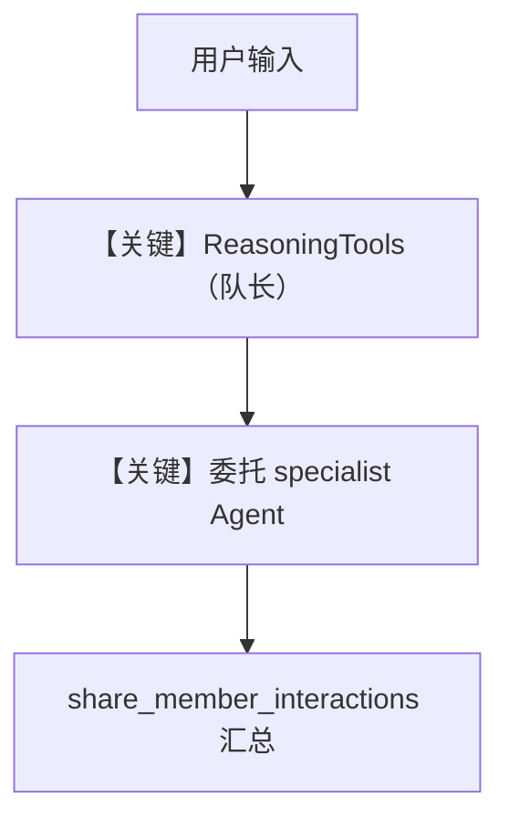

# reasoning_multi_purpose_team.py — 实现原理分析

> 源文件：`cookbook/03_teams/11_reasoning/reasoning_multi_purpose_team.py`

## 概述

本示例展示 **大规模多工具成员 + Team 级 `ReasoningTools` + `share_member_interactions`**：队长在协调前先「推理」，成员覆盖网页、财经、写作、医学、计算器、知识库、GitHub、本地 Python、E2B 沙箱等；并演示 sync 医疗问诊与 async 能力说明两条路径。

**核心配置一览：**

| 配置项 | sync_agent_team | async_agent_team |
|--------|-----------------|------------------|
| `tools` | `ReasoningTools(add_instructions=True, add_few_shot=True)` | `ReasoningTools()` |
| `members` | 7 名（无 medical_agent，有 github/local_python） | 6 名（含 medical_agent、code_agent） |
| `share_member_interactions` | `True` | `True` |
| `markdown` | `True` | `True` |

### 核心机制

- **`ReasoningTools`**：挂载在 **Team** 上，使队长在委托前可执行框架提供的推理步骤。
- **`Knowledge` + `KnowledgeTools`**：`agno_assist` 成员对 `tmp/lancedb` 做 hybrid 检索；`__main__` 中 `ainsert(docs.agno.com/llms-full.txt)` 灌库。
- **数据依赖**：`medical_history.txt` 同步路径读入用户消息。

### 运行机制与因果链

1. **路径**：用户输入 → Team run → 可选 ReasoningTools → 委托成员 → 汇总。
2. **状态**：LanceDB 文件落 `tmp/lancedb`；知识插入在 async demo 前执行。

## System Prompt 组装

队长 `instructions` 字面（sync 与 async 略不同）见 `.py` L180-186、L204-210；**须原样引用**文档不重复。

成员各自 `instructions`/`role` 进入 `<team_members>` 块（默认未自定义 `team.system_message` 时）。

## 完整 API 请求

```python
client.responses.create(model="gpt-5.2", input=..., tools=[...])  # 队长
# 成员调用时各自 OpenAIResponses，工具 schema 合并/委托由 Team 运行时处理
```

## Mermaid 流程图


```mermaid
flowchart TD
    U["用户输入"] --> R["【关键】ReasoningTools（队长）"]
    R --> D["【关键】委托 specialist Agent"]
    D --> S["share_member_interactions 汇总"]
```

## 关键源码文件索引

| 文件 | 作用 |
|------|------|
| `agno/tools/reasoning/` | `ReasoningTools` |
| `agno/team/_messages.py` | `_build_team_context` 成员列表 |
