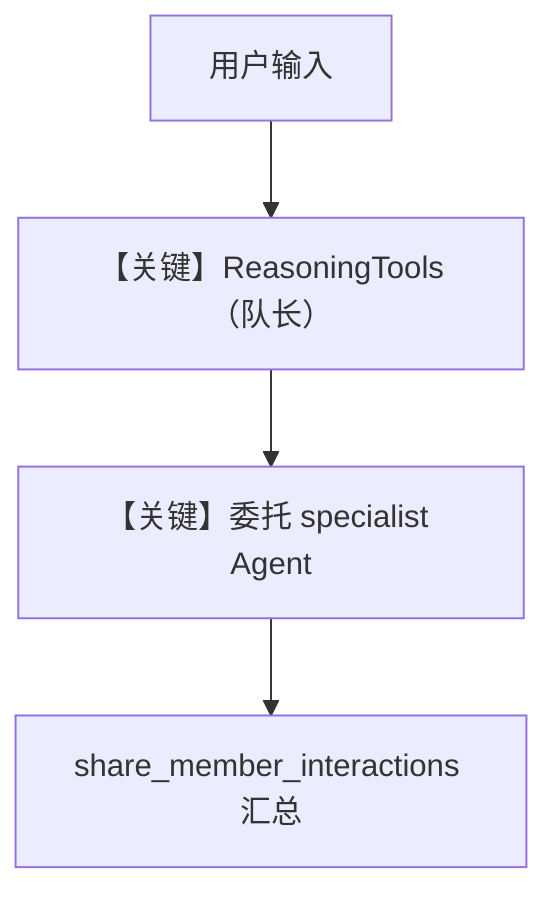

# reasoning_multi_purpose_team.py — 实现原理分析

<!-- cookbook-py-source:start -->
## 完整源码

```python
"""
Reasoning Multi Purpose Team
============================

Demonstrates multi-purpose team reasoning with both sync and async patterns.
"""

import asyncio
from pathlib import Path
from textwrap import dedent

from agno.agent import Agent
from agno.knowledge.embedder.openai import OpenAIEmbedder
from agno.knowledge.knowledge import Knowledge
from agno.models.openai import OpenAIResponses
from agno.team import Team
from agno.tools.calculator import CalculatorTools
from agno.tools.e2b import E2BTools
from agno.tools.file import FileTools
from agno.tools.github import GithubTools
from agno.tools.knowledge import KnowledgeTools
from agno.tools.pubmed import PubmedTools
from agno.tools.python import PythonTools
from agno.tools.reasoning import ReasoningTools
from agno.tools.websearch import WebSearchTools
from agno.tools.yfinance import YFinanceTools
from agno.vectordb.lancedb.lance_db import LanceDb
from agno.vectordb.search import SearchType

# ---------------------------------------------------------------------------
# Setup
# ---------------------------------------------------------------------------
cwd = Path(__file__).parent.resolve()

agno_assist_knowledge = Knowledge(
    vector_db=LanceDb(
        uri="tmp/lancedb",
        table_name="agno_assist_knowledge",
        search_type=SearchType.hybrid,
        embedder=OpenAIEmbedder(id="text-embedding-3-small"),
    ),
)

# ---------------------------------------------------------------------------
# Create Members
# ---------------------------------------------------------------------------
web_agent = Agent(
    name="Web Agent",
    role="Search the web for information",
    model=OpenAIResponses(id="gpt-5.2"),
    tools=[WebSearchTools()],
    instructions=["Always include sources"],
)

finance_agent = Agent(
    name="Finance Agent",
    role="Get financial data",
    model=OpenAIResponses(id="gpt-5.2"),
    tools=[YFinanceTools()],
    instructions=["Use tables to display data"],
)

writer_agent = Agent(
    name="Write Agent",
    role="Write content",
    model=OpenAIResponses(id="gpt-5.2"),
    description="You are an AI agent that can write content.",
    instructions=[
        "You are a versatile writer who can create content on any topic.",
        "When given a topic, write engaging and informative content in the requested format and style.",
        "If you receive mathematical expressions or calculations from the calculator agent, convert them into clear written text.",
        "Ensure your writing is clear, accurate and tailored to the specific request.",
        "Maintain a natural, engaging tone while being factually precise.",
        "Write something that would be good enough to be published in a newspaper like the New York Times.",
    ],
)

medical_agent = Agent(
    name="Medical Agent",
    role="Medical researcher",
    model=OpenAIResponses(id="gpt-5.2"),
    tools=[PubmedTools()],
    instructions=[
        "You are a medical agent that can answer questions about medical topics.",
        "Always search for recent medical literature and evidence.",
    ],
)

calculator_agent = Agent(
    name="Calculator Agent",
    model=OpenAIResponses(id="gpt-5.2"),
    role="Calculate",
    tools=[CalculatorTools()],
)

agno_assist = Agent(
    name="Agno Assist",
    role="You help answer questions about the Agno framework.",
    model=OpenAIResponses(id="gpt-5-mini"),
    instructions="Search your knowledge before answering the question. Help me to write working code for Agno Agents.",
    tools=[
        KnowledgeTools(
            knowledge=agno_assist_knowledge,
            add_instructions=True,
            add_few_shot=True,
        ),
    ],
    add_history_to_context=True,
    add_datetime_to_context=True,
)

github_agent = Agent(
    name="Github Agent",
    role="Do analysis on Github repositories",
    model=OpenAIResponses(id="gpt-5-mini"),
    instructions=[
        "Use your tools to answer questions about the repo: agno-agi/agno",
        "Do not create any issues or pull requests unless explicitly asked to do so",
    ],
    tools=[
        GithubTools(
            include_tools=[
                "list_issues",
                "list_issue_comments",
                "get_pull_request",
                "get_issue",
                "get_pull_request_comments",
            ]
        )
    ],
)

local_python_agent = Agent(
    name="Local Python Agent",
    role="Run Python code locally",
    model=OpenAIResponses(id="gpt-5-mini"),
    instructions=["Use your tools to run Python code locally"],
    tools=[
        FileTools(base_dir=cwd),
        PythonTools(
            base_dir=Path(cwd),
            include_tools=[
                "list_files",
                "run_python_file_return_variable",
                "save_to_file_and_run",
                "uv_pip_install_package",
            ],
        ),
    ],
)

code_agent = Agent(
    name="Code Agent",
    model=OpenAIResponses(id="gpt-5.2"),
    role="Execute and test code",
    tools=[E2BTools()],
    instructions=[
        "Execute code safely in the sandbox environment.",
        "Test code thoroughly before providing results.",
        "Provide clear explanations of code execution.",
    ],
)

# ---------------------------------------------------------------------------
# Create Team
# ---------------------------------------------------------------------------
sync_agent_team = Team(
    name="Multi-Purpose Team",
    model=OpenAIResponses(id="gpt-5.2"),
    tools=[ReasoningTools(add_instructions=True, add_few_shot=True)],
    members=[
        web_agent,
        finance_agent,
        writer_agent,
        calculator_agent,
        agno_assist,
        github_agent,
        local_python_agent,
    ],
    instructions=[
        "You are a team of agents that can answer a variety of questions.",
        "You can use your member agents to answer the questions.",
        "You can also answer directly, you don't HAVE to forward the question to a member agent.",
        "Reason about more complex questions before delegating to a member agent.",
        "If the user is only being conversational, don't use any tools, just answer directly.",
    ],
    markdown=True,
    show_members_responses=True,
    share_member_interactions=True,
)

async_agent_team = Team(
    name="Multi-Purpose Agent Team",
    model=OpenAIResponses(id="gpt-5.2"),
    tools=[ReasoningTools()],
    members=[
        web_agent,
        finance_agent,
        medical_agent,
        calculator_agent,
        agno_assist,
        code_agent,
    ],
    instructions=[
        "You are a team of agents that can answer a variety of questions.",
        "Use reasoning tools to analyze questions before delegating.",
        "You can answer directly or forward to appropriate specialist agents.",
        "For complex questions, reason about the best approach first.",
        "If the user is just being conversational, respond directly without tools.",
    ],
    markdown=True,
    show_members_responses=True,
    share_member_interactions=True,
)


async def run_async_reasoning_demo() -> None:
    await agno_assist_knowledge.ainsert(url="https://docs.agno.com/llms-full.txt")
    await async_agent_team.aprint_response(input="Hi! What are you capable of doing?")


# ---------------------------------------------------------------------------
# Run Team
# ---------------------------------------------------------------------------
if __name__ == "__main__":
    asyncio.run(
        agno_assist_knowledge.ainsert(url="https://docs.agno.com/llms-full.txt")
    )

    txt_path = Path(__file__).parent.resolve() / "medical_history.txt"
    loaded_txt = open(txt_path, "r", encoding="utf-8").read()
    sync_agent_team.print_response(
        input=dedent(
            f"""I have a patient with the following medical information:\n {loaded_txt}
                         What is the most likely diagnosis?
                        """
        ),
    )

    asyncio.run(run_async_reasoning_demo())
```

<!-- cookbook-py-source:end -->

> 源文件：`cookbook/03_teams/11_reasoning/reasoning_multi_purpose_team.py`

## 概述

本示例展示 **大规模多工具成员 + Team 级 `ReasoningTools` + `share_member_interactions`**：队长在协调前先「推理」，成员覆盖网页、财经、写作、医学、计算器、知识库、GitHub、本地 Python、E2B 沙箱等；并演示 sync 医疗问诊与 async 能力说明两条路径。

**核心配置一览：**

| 配置项 | sync_agent_team | async_agent_team |
|--------|-----------------|------------------|
| `tools` | `ReasoningTools(add_instructions=True, add_few_shot=True)` | `ReasoningTools()` |
| `members` | 7 名（无 medical_agent，有 github/local_python） | 6 名（含 medical_agent、code_agent） |
| `share_member_interactions` | `True` | `True` |
| `markdown` | `True` | `True` |

### 核心机制

- **`ReasoningTools`**：挂载在 **Team** 上，使队长在委托前可执行框架提供的推理步骤。
- **`Knowledge` + `KnowledgeTools`**：`agno_assist` 成员对 `tmp/lancedb` 做 hybrid 检索；`__main__` 中 `ainsert(docs.agno.com/llms-full.txt)` 灌库。
- **数据依赖**：`medical_history.txt` 同步路径读入用户消息。

### 运行机制与因果链

1. **路径**：用户输入 → Team run → 可选 ReasoningTools → 委托成员 → 汇总。
2. **状态**：LanceDB 文件落 `tmp/lancedb`；知识插入在 async demo 前执行。

## System Prompt 组装

队长 `instructions` 字面（sync 与 async 略不同）见 `.py` L180-186、L204-210；**须原样引用**文档不重复。

成员各自 `instructions`/`role` 进入 `<team_members>` 块（默认未自定义 `team.system_message` 时）。

## 完整 API 请求

```python
client.responses.create(model="gpt-5.2", input=..., tools=[...])  # 队长
# 成员调用时各自 OpenAIResponses，工具 schema 合并/委托由 Team 运行时处理
```

## Mermaid 流程图


```mermaid
flowchart TD
    U["用户输入"] --> R["【关键】ReasoningTools（队长）"]
    R --> D["【关键】委托 specialist Agent"]
    D --> S["share_member_interactions 汇总"]
```

## 关键源码文件索引

| 文件 | 作用 |
|------|------|
| `agno/tools/reasoning/` | `ReasoningTools` |
| `agno/team/_messages.py` | `_build_team_context` 成员列表 |
