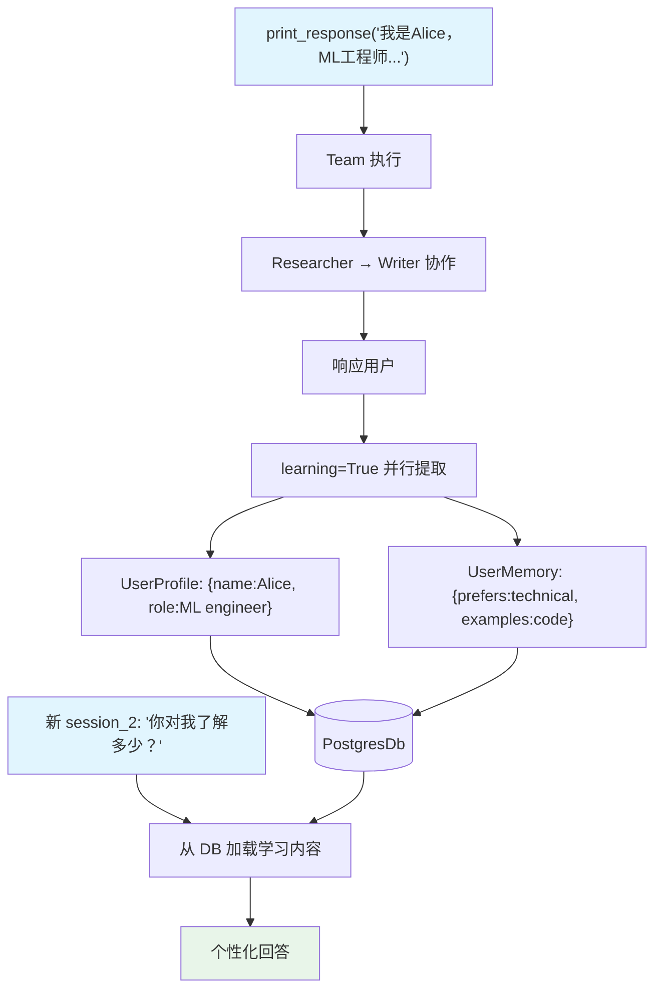

# 01_team_always_learn.py — 实现原理分析

> 源文件：`cookbook/03_teams/12_learning/01_team_always_learn.py`

## 概述

本示例展示 Agno Team 的 **`learning=True` 最简学习模式**：一行配置启用自动学习，团队在每次响应后并行提取用户画像（姓名、角色、偏好）和用户记忆（观察、上下文、模式），存储到 PostgreSQL，跨会话可用。这是为 Team 添加持久记忆的最简方式。

**核心配置一览：**

| 配置项 | 值 | 说明 |
|--------|------|------|
| `learning` | `True` | 启用默认学习模式（ALWAYS） |
| `db` | `PostgresDb` | 持久化存储 |
| `members` | `[researcher, writer]` | 研究+写作成员 |

## 核心组件解析

### `learning=True` 等价配置

`learning=True` 等价于：

```python
learning=LearningMachine(
    user_profile=UserProfileConfig(mode=LearningMode.ALWAYS),
    user_memory=UserMemoryConfig(mode=LearningMode.ALWAYS),
)
```

ALWAYS 模式：每次响应后**自动**（无需 LLM 主动调用工具）提取并更新。

### 并行提取

学习提取在响应生成**后**并行运行，不阻塞响应速度。

### 跨会话记忆验证

```python
# Session 1: 介绍自己
team.print_response("我是Alice，机器学习工程师，偏好技术示例...")

# 检查学习到的画像
lm.user_profile_store.print(user_id=user_id)
# Session 2: 新会话，Team 仍记得 Alice
team.print_response("你对我了解多少？", session_id="session_2")
```

## Mermaid 流程图



## 关键源码文件索引

| 文件 | 关键函数/类 | 作用 |
|------|------------|------|
| `agno/team/team.py` | `learning` | 学习模式配置入口 |
| `agno/learn/__init__.py` | `LearningMachine`, `LearningMode` | 学习机器和模式枚举 |
