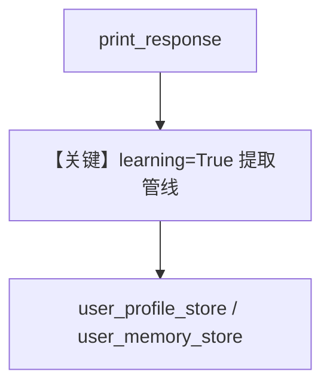

# 01_team_always_learn.py — 实现原理分析

> 源文件：`cookbook/03_teams/12_learning/01_team_always_learn.py`

## 概述

本示例展示 **`learning=True` 简写**：在 Team 上开启自动学习，`LearningMachine` 使用默认配置在每次响应后并行抽取用户画像与记忆，并写入 `PostgresDb`。

**核心配置一览：**

| 配置项 | 值 |
|--------|-----|
| `db` | `PostgresDb(postgresql+psycopg://ai:ai@localhost:5532/ai)` |
| `learning` | `True` |
| `members` | Researcher + Writer |
| `markdown` | `True` |
| `show_members_responses` | `True` |

### 运行机制与因果链

1. **路径**：`print_response` 带 `user_id`/`session_id` → Team 跑对话 → 学习管线异步提取 → `team.learning_machine` 各 store。
2. **状态**：Postgres 持久化；`session_1` 与 `session_2` 展示跨会话回忆。
3. **定位**：最简 **Team 学习** 入口，无自定义 `LearningMachine(...)`。

## System Prompt 组装

学习机制会额外向运行上下文注入与 learn 相关的工具/说明（以 `agno/learn` 实现为准）；本文件未自定义 `instructions`，队长为默认 Team 模板。

## 完整 API 请求

```python
client.responses.create(model="gpt-5.2", input=formatted_input)
```

## Mermaid 流程图


```mermaid
flowchart TD
    P["print_response"] --> L["【关键】learning=True 提取管线"]
    L --> S["user_profile_store / user_memory_store"]
```

## 关键源码文件索引

| 文件 | 作用 |
|------|------|
| `agno/team/team.py` | `learning` 字段 |
| `agno/learn/` | `LearningMachine` 与 stores |
