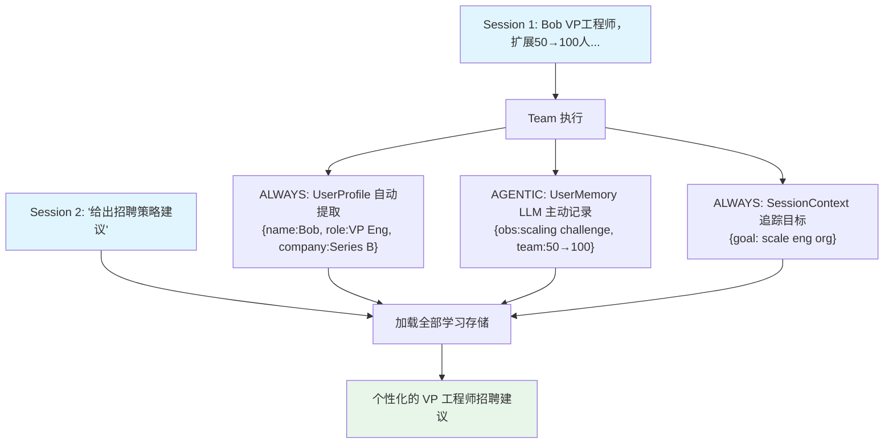

# 02_team_configured_learning.py — 实现原理分析

> 源文件：`cookbook/03_teams/12_learning/02_team_configured_learning.py`

## 概述

本示例展示 Agno Team 的 **精细化 `LearningMachine` 配置**：三个独立的学习存储各自配置独立的 `LearningMode`：UserProfile（ALWAYS 自动）、UserMemory（AGENTIC 主动工具调用）、SessionContext（ALWAYS 自动），展示不同学习维度的灵活组合。

**核心配置一览：**

| 存储 | 模式 | 说明 |
|------|------|------|
| `UserProfileConfig` | `ALWAYS` | 每次自动提取用户结构化画像 |
| `UserMemoryConfig` | `AGENTIC` | LLM 主动调用工具记录观察 |
| `SessionContextConfig` | `ALWAYS` | 自动追踪会话目标和进度 |

## 核心组件解析

### 三种存储的分工

| 存储 | 数据类型 | 持久级别 |
|------|---------|---------|
| `UserProfile` | 结构化用户属性（姓名/角色/公司等） | 跨会话 |
| `UserMemory` | 自由形式的观察和上下文 | 跨会话 |
| `SessionContext` | 当前会话的目标、进度 | 会话级 |

### ALWAYS vs AGENTIC 模式

- **ALWAYS**：响应后自动后台提取，不消耗 LLM 决策资源
- **AGENTIC**：Team Leader 在对话中主动判断何时用 `save_memory(...)` 工具记录，更灵活但依赖 LLM 判断

### SessionContext 的价值

追踪会话内的目标和子任务进度，当用户说"继续之前讨论的工程组织问题"时，Team 能回忆当前会话的讨论上下文。

## Mermaid 流程图

## 关键源码文件索引

| 文件 | 关键函数/类 | 作用 |
|------|------------|------|
| `agno/learn/__init__.py` | `LearningMachine`, `UserProfileConfig`, `UserMemoryConfig`, `SessionContextConfig` | 各存储独立配置 |
