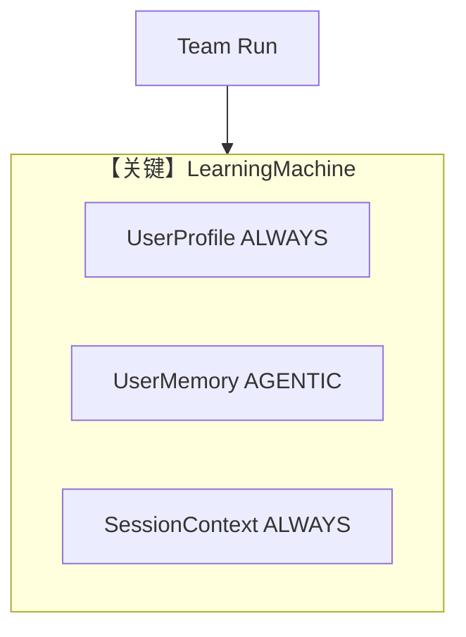

# 02_team_configured_learning.py — 实现原理分析

> 源文件：`cookbook/03_teams/12_learning/02_team_configured_learning.py`

## 概述

本示例展示 **显式 `LearningMachine` 配置**：分别为 `UserProfile`（ALWAYS）、`UserMemory`（AGENTIC）、`SessionContext`（ALWAYS）设置模式，演示多 store 独立工作与跨会话跟进。

**核心配置一览：**

| 配置项 | 值 |
|--------|-----|
| `learning` | `LearningMachine(user_profile=..., user_memory=..., session_context=...)` |
| `UserProfileConfig` | `mode=ALWAYS` |
| `UserMemoryConfig` | `mode=AGENTIC` |
| `SessionContextConfig` | `mode=ALWAYS` |
| `db` | 同上 Postgres |

### 运行机制与因果链

- **ALWAYS**：框架在适当时机自动写入。
- **AGENTIC**：模型通过工具决定是否/如何写入 user memory。

## System Prompt 组装

未设置自定义 `team.system_message`；AGENTIC 记忆会向模型暴露 `update_user_memory` 等工具（以框架注入为准）。

## Mermaid 流程图

```mermaid
flowchart TD
    subgraph LM["【关键】LearningMachine"]
        UP[UserProfile ALWAYS]
        UM[UserMemory AGENTIC]
        SC[SessionContext ALWAYS]
    end
    R["Team Run"] --> LM
```

## 关键源码文件索引

| 文件 | 作用 |
|------|------|
| `agno/learn/__init__.py` | `LearningMachine`、`*Config` |
