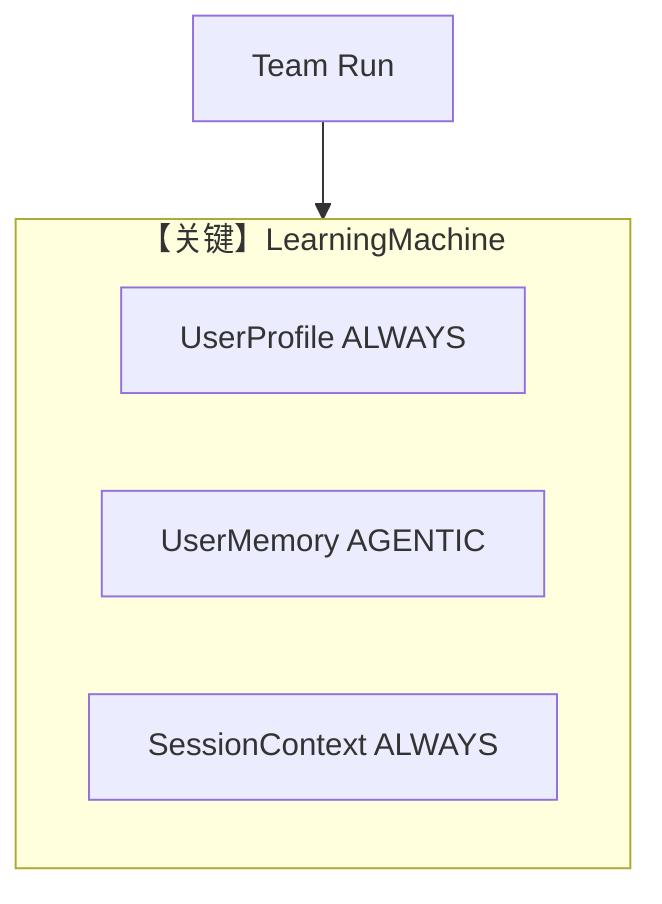

# 02_team_configured_learning.py — 实现原理分析

<!-- cookbook-py-source:start -->
## 完整源码

```python
"""
Team Learning: Configured Stores
=================================
Configure specific learning stores on a Team using LearningMachine.

This example enables:
- UserProfile (ALWAYS mode): Captures structured user fields
- UserMemory (AGENTIC mode): Team uses tools to save observations
- SessionContext (ALWAYS mode): Tracks session goals and progress

Each store can be independently configured with its own mode.
"""

from agno.agent import Agent
from agno.db.postgres import PostgresDb
from agno.learn import (
    LearningMachine,
    LearningMode,
    SessionContextConfig,
    UserMemoryConfig,
    UserProfileConfig,
)
from agno.models.openai import OpenAIResponses
from agno.team import Team

db = PostgresDb(db_url="postgresql+psycopg://ai:ai@localhost:5532/ai")


# ---------------------------------------------------------------------------
# Create Members
# ---------------------------------------------------------------------------
analyst = Agent(
    name="Data Analyst",
    model=OpenAIResponses(id="gpt-5.2"),
    role="Analyze data and provide insights.",
)

advisor = Agent(
    name="Strategy Advisor",
    model=OpenAIResponses(id="gpt-5.2"),
    role="Provide strategic recommendations based on analysis.",
)


# ---------------------------------------------------------------------------
# Create Team
# ---------------------------------------------------------------------------
team = Team(
    name="Advisory Team",
    model=OpenAIResponses(id="gpt-5.2"),
    members=[analyst, advisor],
    db=db,
    learning=LearningMachine(
        user_profile=UserProfileConfig(
            mode=LearningMode.ALWAYS,
        ),
        user_memory=UserMemoryConfig(
            mode=LearningMode.AGENTIC,
        ),
        session_context=SessionContextConfig(
            mode=LearningMode.ALWAYS,
        ),
    ),
    markdown=True,
    show_members_responses=True,
)


# ---------------------------------------------------------------------------
# Run Demo
# ---------------------------------------------------------------------------
if __name__ == "__main__":
    user_id = "bob@example.com"

    # Session 1: Introduction and first task
    print("\n" + "=" * 60)
    print("SESSION 1: Introduction and analysis request")
    print("=" * 60 + "\n")

    team.print_response(
        "I'm Bob, VP of Engineering at a Series B startup. "
        "We have 50 engineers and are scaling to 100. "
        "What should I focus on for our engineering org?",
        user_id=user_id,
        session_id="session_1",
        stream=True,
    )

    lm = team.learning_machine
    print("\n--- User Profile ---")
    lm.user_profile_store.print(user_id=user_id)
    print("\n--- User Memories ---")
    lm.user_memory_store.print(user_id=user_id)
    print("\n--- Session Context ---")
    lm.session_context_store.print(session_id="session_1")

    # Session 2: Follow-up - team knows context
    print("\n" + "=" * 60)
    print("SESSION 2: Follow-up with retained context")
    print("=" * 60 + "\n")

    team.print_response(
        "Given what you know about my situation, "
        "what hiring strategy would you recommend?",
        user_id=user_id,
        session_id="session_2",
        stream=True,
    )
```

<!-- cookbook-py-source:end -->

> 源文件：`cookbook/03_teams/12_learning/02_team_configured_learning.py`

## 概述

本示例展示 **显式 `LearningMachine` 配置**：分别为 `UserProfile`（ALWAYS）、`UserMemory`（AGENTIC）、`SessionContext`（ALWAYS）设置模式，演示多 store 独立工作与跨会话跟进。

**核心配置一览：**

| 配置项 | 值 |
|--------|-----|
| `learning` | `LearningMachine(user_profile=..., user_memory=..., session_context=...)` |
| `UserProfileConfig` | `mode=ALWAYS` |
| `UserMemoryConfig` | `mode=AGENTIC` |
| `SessionContextConfig` | `mode=ALWAYS` |
| `db` | 同上 Postgres |

### 运行机制与因果链

- **ALWAYS**：框架在适当时机自动写入。
- **AGENTIC**：模型通过工具决定是否/如何写入 user memory。

## System Prompt 组装

未设置自定义 `team.system_message`；AGENTIC 记忆会向模型暴露 `update_user_memory` 等工具（以框架注入为准）。

## Mermaid 流程图


```mermaid
flowchart TD
    subgraph LM["【关键】LearningMachine"]
        UP[UserProfile ALWAYS]
        UM[UserMemory AGENTIC]
        SC[SessionContext ALWAYS]
    end
    R["Team Run"] --> LM
```

## 关键源码文件索引

| 文件 | 作用 |
|------|------|
| `agno/learn/__init__.py` | `LearningMachine`、`*Config` |
