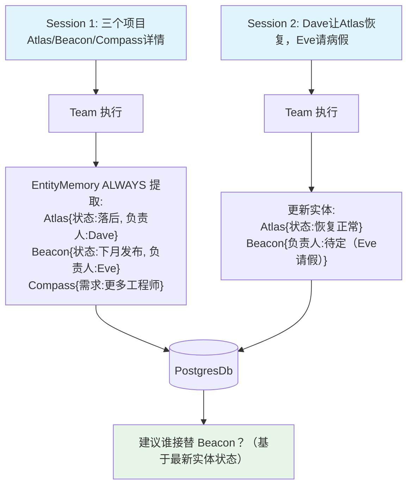

# 03_team_entity_memory.py — 实现原理分析

> 源文件：`cookbook/03_teams/12_learning/03_team_entity_memory.py`

## 概述

本示例展示 Agno Team 的 **`EntityMemoryConfig` 实体记忆**：Team 跟踪对话中出现的具名实体（项目、人物、公司），存储每个实体的事实、事件和关系，支持跨会话按实体查询。适合项目管理、CRM、研究协调等多实体复杂上下文场景。

**核心配置一览：**

| 配置项 | 值 | 说明 |
|--------|------|------|
| `entity_memory` | `EntityMemoryConfig(mode=LearningMode.ALWAYS)` | 实体自动提取 |
| `user_profile` | `UserProfileConfig(mode=LearningMode.ALWAYS)` | 用户画像同时记录 |
| `members` | `[project_manager, technical_lead]` | 项目管理+技术领导 |

## 核心组件解析

### `EntityMemory` 的存储结构

每个实体存储：
- `entity_id`：唯一标识符
- `entity_type`：类型（project/person/company）
- `facts`：关于该实体的事实列表
- `events`：涉及该实体的事件
- `relationships`：与其他实体的关系

### 实体的跨会话更新

```
Session 1: Atlas（项目）→ 落后计划，Dave 领导
Session 2: Atlas → Dave 通过削减范围恢复进度（更新 Atlas 状态）
           Beacon → Eve 病假（更新 Beacon 人员状态）
```

每次会话后，相关实体的记录自动更新，保持最新状态。

### 实体查询

```python
entities = lm.entity_memory_store.search(query="project", user_id=user_id)
for entity in entities:
    lm.entity_memory_store.print(entity_id=entity.entity_id, ...)
```

## Mermaid 流程图



## 关键源码文件索引

| 文件 | 关键函数/类 | 作用 |
|------|------------|------|
| `agno/learn/__init__.py` | `EntityMemoryConfig` | 实体记忆存储配置 |
| `agno/learn/` | `entity_memory_store.search()` | 实体检索 API |
