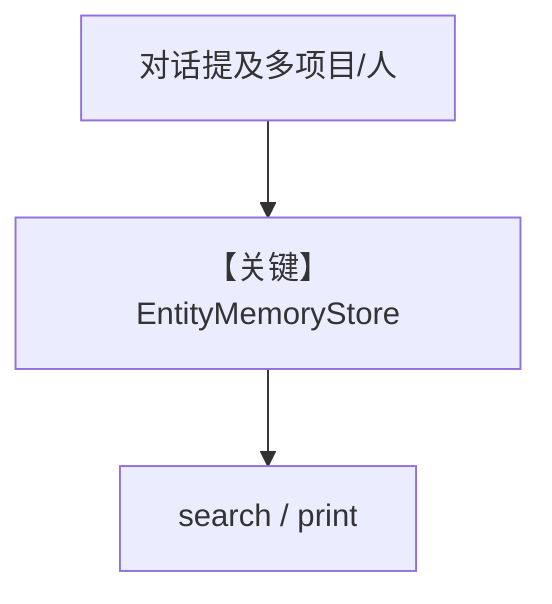

# 03_team_entity_memory.py — 实现原理分析

<!-- cookbook-py-source:start -->
## 完整源码

```python
"""
Team Learning: Entity Memory
=============================
Teams can track entities (people, projects, companies) across conversations
using the EntityMemory store.

Entity memory captures:
- Facts about entities
- Events involving entities
- Relationships between entities

This is useful for teams that deal with complex multi-entity contexts
like project management, CRM, or research coordination.
"""

from agno.agent import Agent
from agno.db.postgres import PostgresDb
from agno.learn import (
    EntityMemoryConfig,
    LearningMachine,
    LearningMode,
    UserProfileConfig,
)
from agno.models.openai import OpenAIResponses
from agno.team import Team

db = PostgresDb(db_url="postgresql+psycopg://ai:ai@localhost:5532/ai")


# ---------------------------------------------------------------------------
# Create Members
# ---------------------------------------------------------------------------
project_manager = Agent(
    name="Project Manager",
    model=OpenAIResponses(id="gpt-5.2"),
    role="Track project status, milestones, and team assignments.",
)

technical_lead = Agent(
    name="Technical Lead",
    model=OpenAIResponses(id="gpt-5.2"),
    role="Provide technical guidance and architecture decisions.",
)


# ---------------------------------------------------------------------------
# Create Team
# ---------------------------------------------------------------------------
team = Team(
    name="Engineering Leadership",
    model=OpenAIResponses(id="gpt-5.2"),
    members=[project_manager, technical_lead],
    db=db,
    learning=LearningMachine(
        user_profile=UserProfileConfig(
            mode=LearningMode.ALWAYS,
        ),
        entity_memory=EntityMemoryConfig(
            mode=LearningMode.ALWAYS,
        ),
    ),
    markdown=True,
    show_members_responses=True,
)


# ---------------------------------------------------------------------------
# Run Demo
# ---------------------------------------------------------------------------
if __name__ == "__main__":
    user_id = "carol@example.com"

    # Session 1: Introduce project context
    print("\n" + "=" * 60)
    print("SESSION 1: Introduce project and team context")
    print("=" * 60 + "\n")

    team.print_response(
        "I'm Carol, engineering director. We have three key projects: "
        "Project Atlas (backend rewrite, led by Dave), "
        "Project Beacon (mobile app, led by Eve), and "
        "Project Compass (data pipeline, led by Frank). "
        "Atlas is behind schedule, Beacon launches next month, "
        "and Compass needs more engineers. What should I prioritize?",
        user_id=user_id,
        session_id="session_1",
        stream=True,
    )

    lm = team.learning_machine
    print("\n--- Entities Tracked ---")
    entities = lm.entity_memory_store.search(query="project", user_id=user_id)
    for entity in entities:
        lm.entity_memory_store.print(
            entity_id=entity.entity_id, entity_type=entity.entity_type, user_id=user_id
        )

    # Session 2: Update and query entities
    print("\n" + "=" * 60)
    print("SESSION 2: Update on projects")
    print("=" * 60 + "\n")

    team.print_response(
        "Good news: Dave got Atlas back on track by cutting scope. "
        "But Eve is now on medical leave - who should take over Beacon?",
        user_id=user_id,
        session_id="session_2",
        stream=True,
    )

    print("\n--- Updated Entities ---")
    entities = lm.entity_memory_store.search(query="project", user_id=user_id)
    for entity in entities:
        lm.entity_memory_store.print(
            entity_id=entity.entity_id, entity_type=entity.entity_type, user_id=user_id
        )
```

<!-- cookbook-py-source:end -->

> 源文件：`cookbook/03_teams/12_learning/03_team_entity_memory.py`

## 概述

本示例展示 **`EntityMemoryConfig`**：在 `LearningMachine` 中启用实体记忆（项目、人员等），`mode=ALWAYS`，与 `UserProfile` 组合，适合多实体项目协调场景。

**核心配置一览：**

| 配置项 | 值 |
|--------|-----|
| `entity_memory` | `EntityMemoryConfig(mode=LearningMode.ALWAYS)` |
| `user_profile` | `UserProfileConfig(mode=ALWAYS)` |

### 运行机制与因果链

用户在多轮中描述 Atlas/Beacon/Compass 等项目 → 实体存储检索 `lm.entity_memory_store.search` → `print` 详情。

## System Prompt 组装

默认 Team；实体记忆通过 learn 子系统注入检索/工具行为，不替代 `<team_members>`。

## Mermaid 流程图


```mermaid
flowchart TD
    C["对话提及多项目/人"] --> E["【关键】EntityMemoryStore"]
    E --> Q["search / print"]
```

## 关键源码文件索引

| 文件 | 作用 |
|------|------|
| `agno/learn/` | `EntityMemoryConfig`、entity store |
