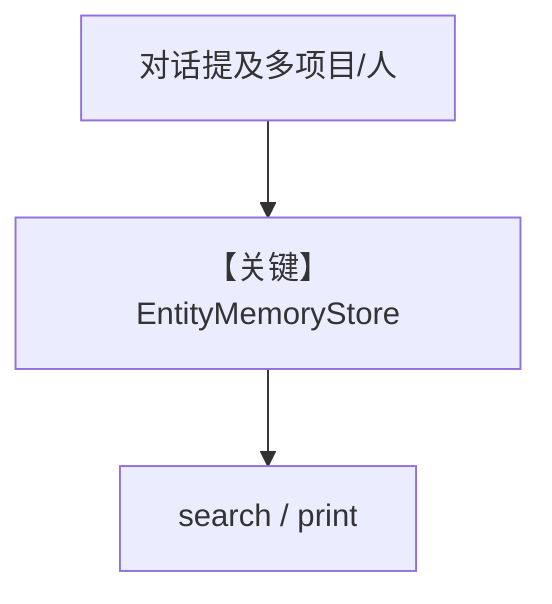

# 03_team_entity_memory.py — 实现原理分析

> 源文件：`cookbook/03_teams/12_learning/03_team_entity_memory.py`

## 概述

本示例展示 **`EntityMemoryConfig`**：在 `LearningMachine` 中启用实体记忆（项目、人员等），`mode=ALWAYS`，与 `UserProfile` 组合，适合多实体项目协调场景。

**核心配置一览：**

| 配置项 | 值 |
|--------|-----|
| `entity_memory` | `EntityMemoryConfig(mode=LearningMode.ALWAYS)` |
| `user_profile` | `UserProfileConfig(mode=ALWAYS)` |

### 运行机制与因果链

用户在多轮中描述 Atlas/Beacon/Compass 等项目 → 实体存储检索 `lm.entity_memory_store.search` → `print` 详情。

## System Prompt 组装

默认 Team；实体记忆通过 learn 子系统注入检索/工具行为，不替代 `<team_members>`。

## Mermaid 流程图

```mermaid
flowchart TD
    C["对话提及多项目/人"] --> E["【关键】EntityMemoryStore"]
    E --> Q["search / print"]
```

## 关键源码文件索引

| 文件 | 作用 |
|------|------|
| `agno/learn/` | `EntityMemoryConfig`、entity store |
