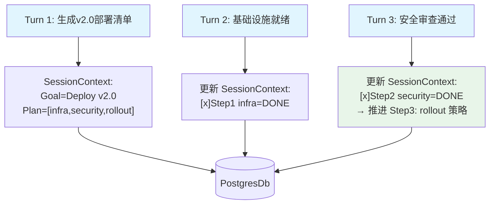

# 04_team_session_planning.py — 实现原理分析

> 源文件：`cookbook/03_teams/12_learning/04_team_session_planning.py`

## 概述

本示例展示 Agno Team 的 **`SessionContextConfig(enable_planning=True)` 会话规划模式**：Team 在会话中自动维护一个结构化的计划（目标+子任务+完成状态），每次对话后更新进度标记。适合多步骤工作流（发布流程、部署检查清单、项目规划等）。

**核心配置一览：**

| 配置项 | 值 | 说明 |
|--------|------|------|
| `session_context` | `SessionContextConfig(enable_planning=True)` | 启用规划追踪 |
| `user_profile` | `UserProfileConfig(mode=LearningMode.ALWAYS)` | 同时记录用户画像 |
| `members` | `[devops_engineer, security_reviewer]` | DevOps+安全审查 |

## 核心组件解析

### `enable_planning=True` 的追踪内容

```
Session Context (session_id="release_v2"):
  Goal: Deploy v2.0 to production
  Plan:
    [x] Step 1: Infrastructure check (DONE - staging passed)
    [x] Step 2: Security review (DONE - cleared)
    [ ] Step 3: Production rollout (IN PROGRESS)
  Current step: 3/3
```

每次对话后自动更新进度，下次对话时 Team 可以感知"我们做到第几步了"。

### 多轮对话的进度连贯性

```
Turn 1: 生成3步检查清单
Turn 2: "基础设施就绪" → 更新 Step 1 为已完成
Turn 3: "安全审查通过" → 更新 Step 2，推进到 Step 3
```

Team 无需每次都重新询问进度，基于 SessionContext 自动感知上下文。

## Mermaid 流程图



## 关键源码文件索引

| 文件 | 关键函数/类 | 作用 |
|------|------------|------|
| `agno/learn/__init__.py` | `SessionContextConfig(enable_planning=True)` | 规划追踪配置 |
| `agno/learn/` | `session_context_store.print()` | 打印会话上下文 |
