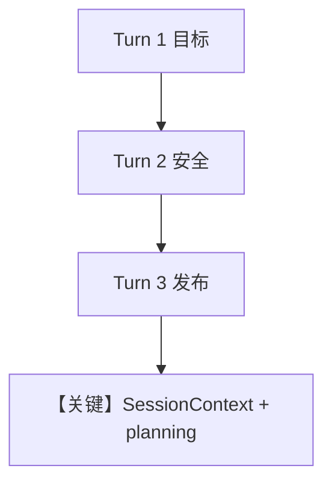

# 04_team_session_planning.py — 实现原理分析

<!-- cookbook-py-source:start -->
## 完整源码

```python
"""
Team Learning: Session Planning
================================
Teams can track session goals and progress using SessionContext
with planning mode enabled.

Planning mode captures:
- Current goal and sub-tasks
- Plan steps with completion status
- Progress markers across turns

This is useful for teams that work on multi-step tasks like
deployment pipelines, project planning, or onboarding flows.
"""

from agno.agent import Agent
from agno.db.postgres import PostgresDb
from agno.learn import (
    LearningMachine,
    LearningMode,
    SessionContextConfig,
    UserProfileConfig,
)
from agno.models.openai import OpenAIResponses
from agno.team import Team

db = PostgresDb(db_url="postgresql+psycopg://ai:ai@localhost:5532/ai")


# ---------------------------------------------------------------------------
# Create Members
# ---------------------------------------------------------------------------
devops_engineer = Agent(
    name="DevOps Engineer",
    model=OpenAIResponses(id="gpt-5.2"),
    role="Handle infrastructure, CI/CD, and deployment tasks.",
)

security_reviewer = Agent(
    name="Security Reviewer",
    model=OpenAIResponses(id="gpt-5.2"),
    role="Review security considerations and compliance requirements.",
)


# ---------------------------------------------------------------------------
# Create Team
# ---------------------------------------------------------------------------
team = Team(
    name="Release Team",
    model=OpenAIResponses(id="gpt-5.2"),
    members=[devops_engineer, security_reviewer],
    db=db,
    learning=LearningMachine(
        user_profile=UserProfileConfig(
            mode=LearningMode.ALWAYS,
        ),
        session_context=SessionContextConfig(
            enable_planning=True,
        ),
    ),
    markdown=True,
    show_members_responses=True,
)


# ---------------------------------------------------------------------------
# Run Demo
# ---------------------------------------------------------------------------
if __name__ == "__main__":
    user_id = "diana@example.com"
    session_id = "release_v2"

    # Turn 1: Define the release goal
    print("\n" + "=" * 60)
    print("TURN 1: Define release goal")
    print("=" * 60 + "\n")

    team.print_response(
        "I'm Diana, release manager. We need to deploy v2.0 to production. "
        "Give me a 3-step release checklist covering infra, security, and rollout.",
        user_id=user_id,
        session_id=session_id,
        stream=True,
    )

    lm = team.learning_machine
    print("\n--- Session Context ---")
    lm.session_context_store.print(session_id=session_id)

    # Turn 2: Complete first step
    print("\n" + "=" * 60)
    print("TURN 2: Infrastructure ready")
    print("=" * 60 + "\n")

    team.print_response(
        "Infrastructure is ready - staging tests passed. "
        "What security checks should we run before proceeding?",
        user_id=user_id,
        session_id=session_id,
        stream=True,
    )

    print("\n--- Updated Session Context ---")
    lm.session_context_store.print(session_id=session_id)

    # Turn 3: Final step
    print("\n" + "=" * 60)
    print("TURN 3: Security cleared, ready for rollout")
    print("=" * 60 + "\n")

    team.print_response(
        "Security review passed. What's the recommended rollout strategy?",
        user_id=user_id,
        session_id=session_id,
        stream=True,
    )

    print("\n--- Final Session Context ---")
    lm.session_context_store.print(session_id=session_id)
```

<!-- cookbook-py-source:end -->

> 源文件：`cookbook/03_teams/12_learning/04_team_session_planning.py`

## 概述

本示例展示 **`SessionContextConfig(enable_planning=True)`**：在会话上下文中跟踪目标、子任务与进度，适用于多轮发布/上线 checklist。

**核心配置一览：**

| 配置项 | 值 |
|--------|-----|
| `session_context` | `SessionContextConfig(enable_planning=True)` |
| `user_profile` | `UserProfileConfig(ALWAYS)` |
| `session_id` | `release_v2`（多轮复用） |

### 运行机制与因果链

同一 `session_id` 下三轮对话推进发布流程 → `lm.session_context_store.print` 展示演进。

## Mermaid 流程图


```mermaid
flowchart TD
    T1["Turn 1 目标"] --> T2["Turn 2 安全"] --> T3["Turn 3 发布"]
    T3 --> SC["【关键】SessionContext + planning"]
```

## 关键源码文件索引

| 文件 | 作用 |
|------|------|
| `agno/learn/` | `SessionContextConfig`、`enable_planning` |
