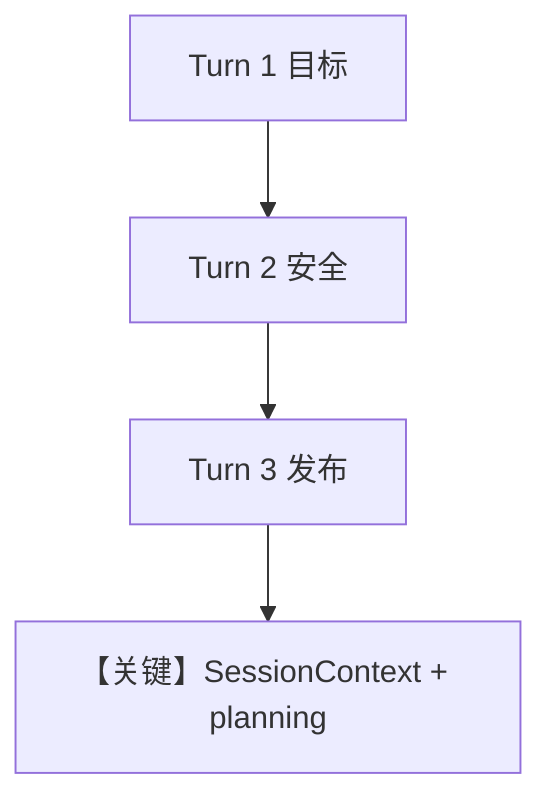

# 04_team_session_planning.py — 实现原理分析

> 源文件：`cookbook/03_teams/12_learning/04_team_session_planning.py`

## 概述

本示例展示 **`SessionContextConfig(enable_planning=True)`**：在会话上下文中跟踪目标、子任务与进度，适用于多轮发布/上线 checklist。

**核心配置一览：**

| 配置项 | 值 |
|--------|-----|
| `session_context` | `SessionContextConfig(enable_planning=True)` |
| `user_profile` | `UserProfileConfig(ALWAYS)` |
| `session_id` | `release_v2`（多轮复用） |

### 运行机制与因果链

同一 `session_id` 下三轮对话推进发布流程 → `lm.session_context_store.print` 展示演进。

## Mermaid 流程图

```mermaid
flowchart TD
    T1["Turn 1 目标"] --> T2["Turn 2 安全"] --> T3["Turn 3 发布"]
    T3 --> SC["【关键】SessionContext + planning"]
```

## 关键源码文件索引

| 文件 | 作用 |
|------|------|
| `agno/learn/` | `SessionContextConfig`、`enable_planning` |
