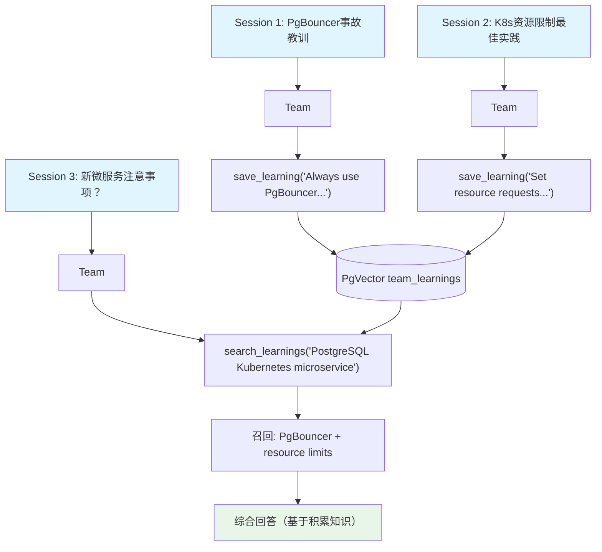

# 05_team_learned_knowledge.py — 实现原理分析

> 源文件：`cookbook/03_teams/12_learning/05_team_learned_knowledge.py`

## 概述

本示例展示 Agno Team 的 **`LearnedKnowledgeConfig` 机构知识库**：Team 在对话中主动调用 `save_learning` 工具将最佳实践、事故教训等存入向量数据库（PgVector），后续遇到相关问题时自动 `search_learnings` 检索并应用历史知识，实现团队知识的积累和复用。

**核心配置一览：**

| 配置项 | 值 | 说明 |
|--------|------|------|
| `learned_knowledge` | `LearnedKnowledgeConfig(mode=LearningMode.AGENTIC)` | 主动工具调用保存知识 |
| `knowledge` | `Knowledge(PgVector hybrid)` | 向量知识存储 |
| `members` | `[sre_engineer, platform_engineer]` | SRE+平台工程师 |

## 核心组件解析

### `save_learning` vs `search_learnings`

| 工具 | 触发条件 | 方向 |
|------|---------|------|
| `save_learning(insight, context)` | 用户说"记住这个最佳实践" | 写 → PgVector |
| `search_learnings(query)` | 新问题与已有知识相关 | 读 ← PgVector |

### 知识积累的价值

```
Session 1: PgBouncer 连接池事故 → save_learning
Session 2: Kubernetes 资源限制 → save_learning
Session 3: "新微服务接PostgreSQL+K8s注意什么？"
          → search_learnings → 召回前两条知识
          → 回答: "1. 用PgBouncer... 2. 设置resource requests..."
```

机构知识不再依赖个人记忆，而是结构化存储在向量数据库，永久可检索。

### `SearchType.hybrid` 的优势

混合搜索（向量+BM25）确保"connection pool"等关键术语和语义相似内容都能被召回。

## Mermaid 流程图



## 关键源码文件索引

| 文件 | 关键函数/类 | 作用 |
|------|------------|------|
| `agno/learn/__init__.py` | `LearnedKnowledgeConfig` | 机构知识库配置 |
| `agno/vectordb/pgvector.py` | `PgVector(SearchType.hybrid)` | 向量+BM25 混合检索 |
