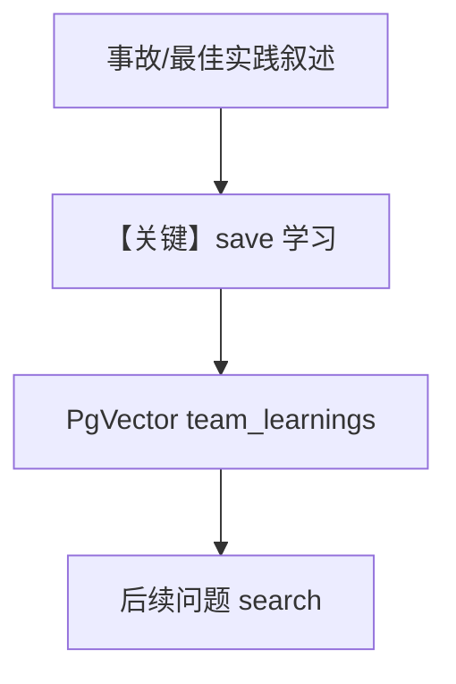

# 05_team_learned_knowledge.py — 实现原理分析

> 源文件：`cookbook/03_teams/12_learning/05_team_learned_knowledge.py`

## 概述

本示例展示 **`LearnedKnowledgeConfig` + `Knowledge`（PgVector）**：团队通过工具将可复用经验写入向量库，并在后续问题中检索，形成机构知识沉淀。

**核心配置一览：**

| 配置项 | 值 |
|--------|-----|
| `knowledge` | `Knowledge(vector_db=PgVector(..., table_name="team_learnings", ...))` |
| `learning` | `LearningMachine(knowledge=knowledge, learned_knowledge=LearnedKnowledgeConfig(mode=AGENTIC))` |
| `db` | `PostgresDb`（与应用库同 URL） |

### 运行机制与因果链

AGENTIC 模式：模型在适当时机调用 `save_learning` / `search_learnings`（名称以实际工具为准）→ `learned_knowledge_store.print` 验证。

## System Prompt 组装

Learned knowledge 工具与说明由 `LearningMachine` 注入队长/运行上下文；`Knowledge` 的 `build_context` 若启用会参与 RAG（本示例侧重 **学习存储**）。

## Mermaid 流程图

```mermaid
flowchart TD
    I["事故/最佳实践叙述"] --> S["【关键】save 学习"]
    S --> V["PgVector team_learnings"]
    V --> Q["后续问题 search"]
```

## 关键源码文件索引

| 文件 | 作用 |
|------|------|
| `agno/learn/` | `LearnedKnowledgeConfig` |
| `agno/knowledge/knowledge.py` | `Knowledge` |
