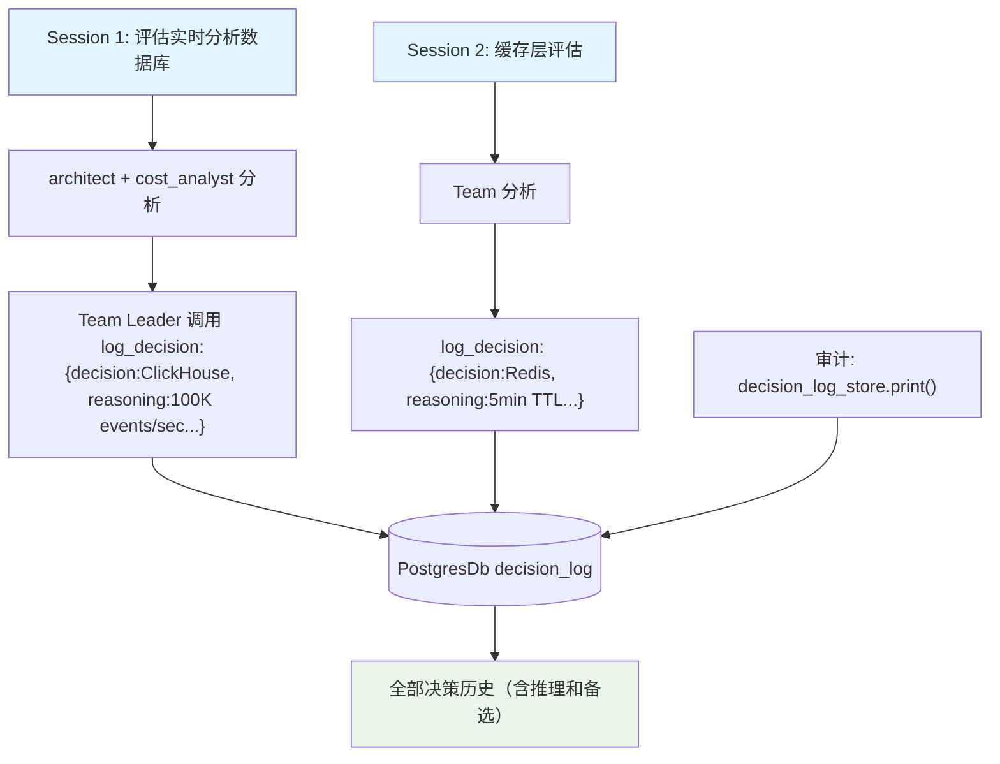

# 06_team_decision_log.py — 实现原理分析

> 源文件：`cookbook/03_teams/12_learning/06_team_decision_log.py`

## 概述

本示例展示 Agno Team 的 **`DecisionLogConfig` 决策日志**：Team 在做重大技术决策时，主动调用 `log_decision` 工具记录决策内容、推理过程和备选方案，存储到 PostgreSQL，支持审计、调试和知识传承。适合架构决策委员会、安全审查、合规决策等需要可追溯性的场景。

**核心配置一览：**

| 配置项 | 值 | 说明 |
|--------|------|------|
| `decision_log` | `DecisionLogConfig(mode=LearningMode.AGENTIC, enable_agent_tools=True, agent_can_save=True, agent_can_search=True)` | 主动决策日志 |
| `members` | `[architect, cost_analyst]` | 架构师+成本分析师 |
| `instructions` | 包含"使用 log_decision 工具记录" | 明确指导使用 |

## 核心组件解析

### `DecisionLogConfig` 参数说明

| 参数 | 值 | 说明 |
|------|-----|------|
| `mode` | `AGENTIC` | LLM 主动决定何时记录 |
| `enable_agent_tools` | `True` | 启用 log_decision 和 search_decisions 工具 |
| `agent_can_save` | `True` | Leader 可调用 log_decision 写入 |
| `agent_can_search` | `True` | Leader 可调用 search_decisions 检索历史决策 |

### 决策日志结构

```json
{
  "decision": "选择 ClickHouse 作为实时分析数据库",
  "reasoning": "100K events/sec 需求超出 PostgreSQL 能力；ClickHouse 具备最优列式存储性能",
  "alternatives": ["PostgreSQL+TimescaleDB: 适合中等负载", "Apache Druid: 运维复杂度高"],
  "context": "实时分析服务，100K events/sec，sub-second 查询延迟",
  "session_id": "session_1",
  "timestamp": "2026-03-01T..."
}
```

### 历史决策的复用价值

```python
# 同一 session 或跨 session 可检索
lm.decision_log_store.print(session_id="session_1", limit=5)
lm.decision_log_store.print(limit=5)  # 全局决策日志
```

## Mermaid 流程图



## 关键源码文件索引

| 文件 | 关键函数/类 | 作用 |
|------|------------|------|
| `agno/learn/__init__.py` | `DecisionLogConfig` | 决策日志存储配置 |
| `agno/learn/` | `decision_log_store.print()` | 决策日志检索 |
