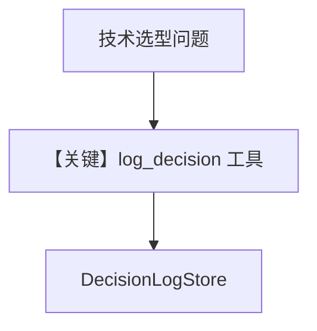

# 06_team_decision_log.py — 实现原理分析

<!-- cookbook-py-source:start -->
## 完整源码

```python
"""
Team Learning: Decision Logging
================================
Teams can log decisions for auditing, debugging, and learning
using the DecisionLogStore.

Decision logs capture:
- What decision was made
- Reasoning and alternatives considered
- Context and outcomes

This is useful for teams where traceability matters,
like architecture decisions, security reviews, or compliance.
"""

from agno.agent import Agent
from agno.db.postgres import PostgresDb
from agno.learn import (
    DecisionLogConfig,
    LearningMachine,
    LearningMode,
)
from agno.models.openai import OpenAIResponses
from agno.team import Team

db = PostgresDb(db_url="postgresql+psycopg://ai:ai@localhost:5532/ai")


# ---------------------------------------------------------------------------
# Create Members
# ---------------------------------------------------------------------------
architect = Agent(
    name="Solutions Architect",
    model=OpenAIResponses(id="gpt-5.2"),
    role="Evaluate architecture options and trade-offs.",
)

cost_analyst = Agent(
    name="Cost Analyst",
    model=OpenAIResponses(id="gpt-5.2"),
    role="Analyze cost implications of technical decisions.",
)


# ---------------------------------------------------------------------------
# Create Team
# ---------------------------------------------------------------------------
team = Team(
    name="Architecture Review Board",
    model=OpenAIResponses(id="gpt-5.2"),
    members=[architect, cost_analyst],
    db=db,
    learning=LearningMachine(
        decision_log=DecisionLogConfig(
            mode=LearningMode.AGENTIC,
            enable_agent_tools=True,
            agent_can_save=True,
            agent_can_search=True,
        ),
    ),
    instructions=[
        "You are an architecture review board.",
        "When making significant technical decisions, use the log_decision tool to record them.",
        "Include your reasoning and any alternatives you considered.",
    ],
    markdown=True,
    show_members_responses=True,
)


# ---------------------------------------------------------------------------
# Run Demo
# ---------------------------------------------------------------------------
if __name__ == "__main__":
    user_id = "grace@example.com"

    # Session 1: Make an architecture decision
    print("\n" + "=" * 60)
    print("SESSION 1: Database selection decision")
    print("=" * 60 + "\n")

    team.print_response(
        "We need to choose a database for our new real-time analytics service. "
        "Options are PostgreSQL with TimescaleDB, ClickHouse, or Apache Druid. "
        "We expect 100K events/sec and need sub-second query latency. "
        "Please evaluate and log your decision.",
        user_id=user_id,
        session_id="session_1",
        stream=True,
    )

    lm = team.learning_machine
    print("\n--- Decision Log ---")
    lm.decision_log_store.print(session_id="session_1", limit=5)

    # Session 2: Another decision
    print("\n" + "=" * 60)
    print("SESSION 2: Caching strategy decision")
    print("=" * 60 + "\n")

    team.print_response(
        "For the same analytics service, we need a caching layer. "
        "Should we use Redis, Memcached, or an in-process cache like Caffeine? "
        "We need to cache aggregated query results with 5-minute TTL. "
        "Please evaluate and log your decision.",
        user_id=user_id,
        session_id="session_2",
        stream=True,
    )

    print("\n--- Updated Decision Log ---")
    lm.decision_log_store.print(limit=5)
```

<!-- cookbook-py-source:end -->

> 源文件：`cookbook/03_teams/12_learning/06_team_decision_log.py`

## 概述

本示例展示 **`DecisionLogConfig`**（AGENTIC + `enable_agent_tools` + `agent_can_save` + `agent_can_search`）：架构评审类 Team 在重大技术决策时写入决策日志，支持审计与复盘。

**核心配置一览：**

| 配置项 | 值 |
|--------|-----|
| `learning` | `LearningMachine(decision_log=DecisionLogConfig(...))` |
| `instructions` | 要求显著决策时使用 `log_decision`（见 `.py` L61-64） |

### 运行机制与因果链

用户提出选型问题 → 队长协调成员 → 通过工具记录决策 → `decision_log_store.print` 查看。

## System Prompt 组装

队长 `instructions` 字面：

```text
You are an architecture review board.
When making significant technical decisions, use the log_decision tool to record them.
Include your reasoning and any alternatives you considered.
```

## Mermaid 流程图


```mermaid
flowchart TD
    Q["技术选型问题"] --> D["【关键】log_decision 工具"]
    D --> L["DecisionLogStore"]
```

## 关键源码文件索引

| 文件 | 作用 |
|------|------|
| `agno/learn/` | `DecisionLogConfig`、decision store |
